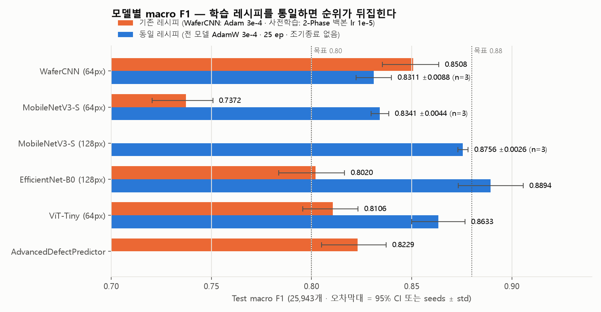
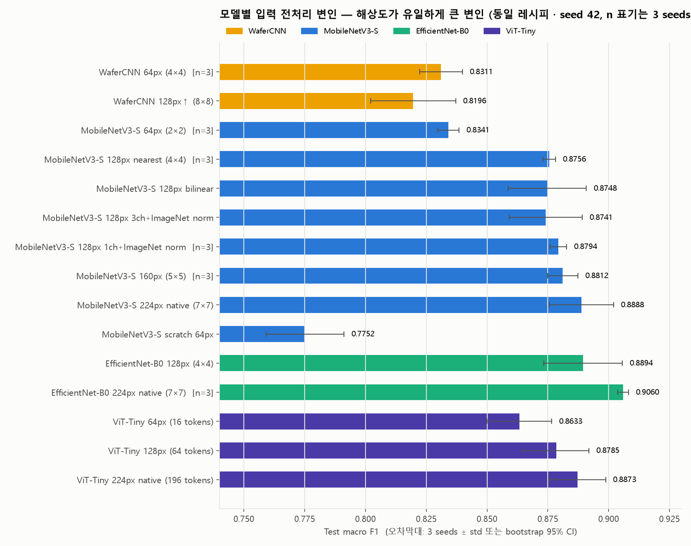
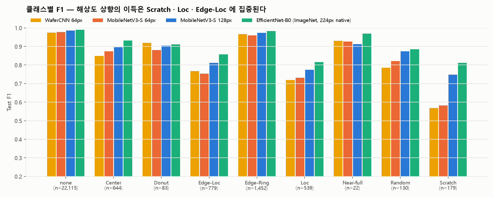
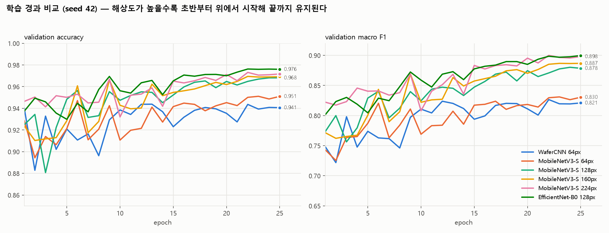

# WM-811K 웨이퍼 불량 검출 — MLOps + 소자 엔지니어링 고도화

> **SK하이닉스 Device Engineering 직무 포트폴리오**
> 반도체 웨이퍼 불량 패턴 분류를 넘어, 물리적 원인 규명 → 공정 파라미터 최적화 → 수율 개선 우선순위 도출까지 연결한 의사결정 지원 시스템

---

## 핵심 성과

| 항목 | 수치 | 근거 파일 |
|------|------|----------|
| 분석 데이터 | WM-811K 중 레이블 **172,950개** (클래스 불균형 989.5×) | `analysis/data_summary.json` |
| 최고 분류 성능 (동일 레시피 비교) | EfficientNet-B0 224px **macro F1 0.9060 ± 0.0022** (3 seeds) / Acc 97.80% · 엣지 후보 MobileNetV3-S 160px **0.8812 ± 0.0062** (1.53M) | `analysis/fair_compare/summary.json` |
| 기존 레시피 최고 (재학습) | WaferCNN **macro F1 0.8508** / Accuracy 95.85% | `analysis/final_evaluation.json` |
| Multi-output 모델 (재학습) | **macro F1 0.8229** / Accuracy 95.12% (분류+심각도+신뢰도) | 〃 |
| ONNX 변환 | MobileNetV3-S 160px: macro F1 **손실 0.0000** (0.8884 → 0.8884), 예측 일치 100% | `analysis/deployment_summary_v2.json` |
| 추론 속도 | 160px 모델 ONNX CPU **10.4ms** (batch=32) · PyTorch CPU 대비 단일 추론 9.7× | 〃 |
| 단일 웨이퍼 추론 | **0.70ms** (데스크톱 CPU 4 threads, RPi 추정 4~7ms) | 〃 |
| 공정 최적화 | 개선 우선순위 **Edge-Ring > Edge-Loc > Center** 도출 | `reports/roi_summary.csv` |

> 분류 성능은 2026-09-13~14 에 RTX 4070 Laptop 에서 **전부 다시 학습·측정**한 값입니다.
> 기존 레시피 수치는 `scripts/evaluate_all.py`, 동일 레시피 비교는 `scripts/fair_compare.py --summarize` 로 재현되며,
> 상세 표와 클래스별 지표는 [`docs/MODEL_PERFORMANCE.md`](docs/MODEL_PERFORMANCE.md) 에 있습니다.

---

## 성능 측정 기준 (먼저 읽어주세요)

포트폴리오 수치는 **측정 조건이 명시되지 않으면 의미가 없습니다.** 본 프로젝트의 모든 성능은 아래 단일 기준으로 산출했습니다.

| 항목 | 기준 |
|------|------|
| 평가 데이터 | **Test 분할 25,943개** — 증강 없음, WeightedRandomSampler 없음, 원본 불균형 분포 그대로 |
| 지표 산출 | 하나의 체크포인트에서 **Accuracy · macro F1 · weighted F1 · macro P/R 을 동시 계산** |
| 불확실성 | macro F1 에 **테스트셋 bootstrap 1,000회 95% 신뢰구간** 병기 (폭 약 ±0.014). 동일 레시피 비교는 **3 seeds 평균 ± 표준편차** |
| 표에 기재된 값 | 전부 **Test** 기준 (Validation 값 혼용 없음) |
| 재현 | `python scripts/evaluate_all.py` · `python scripts/fair_compare.py --summarize` |

**테스트셋 클래스 분포**
`none 22,115 · Edge-Ring 1,452 · Edge-Loc 779 · Center 644 · Loc 539 · Scratch 179 · Random 130 · Donut 83 · Near-full 22`

> 이전 버전의 README는 학습 도중 기록된 Validation 지표와 재학습 이전의 Test 지표가 섞여 있어
> **macro F1 0.501 / Accuracy 10.65%** 처럼 동시에 성립할 수 없는 조합이 게시되어 있었습니다.
> 전 모델을 동일 체크포인트·동일 테스트셋에서 재측정하여 교체했습니다.

---

## 모델 성능 비교

### C-1. 기존 학습 레시피 그대로 재학습 (Test 25,943개 · `analysis/final_evaluation.json`)

| 모델 | 파라미터 | Accuracy | **macro F1** | 95% CI | weighted F1 | macro P | macro R | 비고 |
|------|---------:|---------:|-------------:|:------:|------------:|--------:|--------:|------|
| **WaferCNN** | 1.21M | **95.85%** | **0.8508** | 0.835–0.864 | 0.9616 | 0.793 | 0.934 | 커스텀 4-Conv CNN · Adam 3e-4 · 40 ep |
| AdvancedDefectPredictor | 1.13M | 95.12% | 0.8229 | 0.805–0.837 | 0.9549 | 0.778 | 0.885 | Multi-output (분류+심각도+신뢰도) |
| ViT-Tiny | 5.39M | 94.34% | 0.8106 | 0.796–0.823 | 0.9495 | 0.759 | 0.896 | 2-Phase 파인튜닝 (백본 lr 1e-5) |
| EfficientNet-B0 | 4.02M | 94.16% | 0.8020 | 0.784–0.817 | 0.9478 | 0.731 | 0.916 | 2-Phase 파인튜닝 |
| MobileNetV3-Small | 1.53M | 90.41% | 0.7372 | 0.720–0.751 | 0.9196 | 0.661 | 0.891 | 2-Phase 파인튜닝 · **엣지 배포 채택 모델** |

이전 README 값(WaferCNN 0.8458 · ViT 0.8352 · EffNet 0.7944 · MobileNet 0.7369)과 ±0.025 안에서 일치합니다. 즉 **기존 수치 자체는 재현되지만**, 아래 C-2 가 보여주듯 그 순위는 아키텍처가 아니라 학습 레시피가 만든 것입니다.

### C-2. 동일 레시피 공정 비교 (`scripts/fair_compare.py` · `analysis/fair_compare/summary.md`)

모든 모델을 **같은** 옵티마이저(AdamW 3e-4) · 증강 · WeightedRandomSampler · CrossEntropy · 25 epoch cosine · 조기종료 없음 · val macro F1 선택 기준으로 학습했습니다.

| 모델 | 입력 | 파라미터 | seeds | Accuracy | **macro F1 (mean ± std)** | weighted F1 | macro P | macro R |
|------|:----:|---------:|:-----:|---------:|--------------------------:|------------:|--------:|--------:|
| **EfficientNet-B0** (ImageNet) | **224px↑** (원본) | 4.02M | 3 | **97.80%** | **0.9060 ± 0.0022** | 0.9783 | 0.903 | 0.911 |
| EfficientNet-B0 (ImageNet) | 128px↑ | 4.02M | 1 | 97.54% | 0.8894 | 0.9759 | 0.876 | 0.906 |
| MobileNetV3-Small (ImageNet) | 224px↑ (원본) | 1.53M | 1 | 97.27% | 0.8888 | 0.9735 | 0.870 | 0.911 |
| ViT-Tiny (ImageNet) | 224px↑ (196 tokens) | 5.43M | 1 | 96.92% | 0.8873 | 0.9707 | 0.860 | 0.920 |
| **MobileNetV3-Small** (ImageNet) | **160px↑** | 1.53M | 3 | 96.90% | **0.8812 ± 0.0062** | 0.9701 | 0.861 | 0.905 |
| MobileNetV3-Small (ImageNet) | 128px↑ + ImageNet norm | 1.53M | 3 | 96.96% | 0.8794 ± 0.0034 | 0.9706 | 0.862 | 0.901 |
| ViT-Tiny (ImageNet) | 128px↑ (64 tokens) | 5.40M | 1 | 97.00% | 0.8785 | 0.9712 | 0.855 | 0.908 |
| MobileNetV3-Small (ImageNet) | 128px↑ | 1.53M | 3 | 96.91% | 0.8756 ± 0.0026 | 0.9702 | 0.853 | 0.903 |
| ViT-Tiny (ImageNet) | 64px (16 tokens) | 5.39M | 1 | 96.53% | 0.8633 | 0.9668 | 0.841 | 0.891 |
| MobileNetV3-Small (ImageNet) | 64px | 1.53M | 3 | 95.52% | 0.8341 ± 0.0044 | 0.9584 | 0.789 | 0.896 |
| WaferCNN (scratch) | 64px | 1.21M | 3 | 95.11% | 0.8311 ± 0.0088 | 0.9556 | 0.767 | 0.934 |
| WaferCNN (scratch) | 128px↑ (대조군) | 1.21M | 1 | 95.41% | 0.8196 | 0.9587 | 0.755 | 0.929 |
| MobileNetV3-Small (scratch) | 64px | 1.53M | 1 | 92.37% | 0.7752 | 0.9337 | 0.710 | 0.896 |

40 epoch 예산 확인 (seed 42): WaferCNN **0.8367** vs MobileNetV3-S 128px **0.8847** — 예산을 늘려도 순위는 바뀌지 않습니다. `px↑` 는 64×64 맵을 nearest 로 확대한 것으로 정보 추가는 없습니다.

**입력 전처리 변인 분리 (2차 → 3 seeds 로 확정):** MobileNetV3-S 128px 기준 0.8756 ± 0.0026 에 대해 보간 nearest→bilinear 0.8748, 3ch 복제+ImageNet 정규화 0.8741 은 잡음 범위이고, 1ch+ImageNet 정규화는 0.8794 ± 0.0034, 160px 는 0.8812 ± 0.0062 로 **+0.004~0.006 의 작은 이득이며 표준편차 1~2배 수준**입니다. 해상도 곡선 64→128→160→224px = 0.834→0.876→0.881→0.889 에서 **큰 이득은 64→128 구간(+0.042)** 에 있고 그 이후는 완만합니다. WaferCNN 은 128px 로 올려도 0.8196 으로 개선되지 않아 이 효과가 stride-32 사전학습 백본에 특유한 구조적 현상임을 확인했습니다. EfficientNet-B0 224px 는 3 seeds 0.9060 ± 0.0022 로 유일하게 표준편차가 작으면서 0.90 을 넘습니다.




**목표(macro F1 ≥ 0.80) 달성:** 기존 레시피 — WaferCNN · AdvancedDefectPredictor · ViT-Tiny · EfficientNet-B0 / 동일 레시피 — 사전학습 모델 전부. **목표 0.88 을 3 seeds 평균으로 달성한 것은 EfficientNet-B0 224px(0.906 ± 0.002) · MobileNetV3-S 160px(0.881 ± 0.006)** 이며, 단일 seed 로는 EfficientNet-B0 128px(0.889) · MobileNetV3-S 224px(0.889) · ViT-Tiny 224px(0.887) 도 넘습니다.

### 관찰 1 — "커스텀 CNN이 사전학습 모델을 이겼다"는 레시피 차이였다

이전 README 는 WaferCNN(1.21M) 이 ViT-Tiny · MobileNetV3 를 이긴 것을 "웨이퍼 맵에는 ImageNet 전이가 통하지 않는다"로 해석했습니다. 동일 레시피 재실험 결과 이 해석은 **틀렸습니다.**

| 원인 | 기존 파인튜닝 레시피 | 영향 (동일 레시피 실험으로 분리) |
|------|---------------------|----------------------------------|
| **백본 학습률** | 2-Phase: 백본 **1e-5**, head 1e-4 (WaferCNN 은 전체 3e-4) | MobileNetV3 64px 를 3e-4 로 전체 학습 → **0.7372 → 0.8341** (+0.097) |
| **입력 해상도** | 64×64 를 stride-32 백본에 그대로 → 마지막 feature map **2×2** | 128px 업샘플로 4×4 확보 → **0.8341 → 0.8756** (+0.042) |
| **ImageNet 전이** | — | 같은 조건에서 scratch 0.7752 vs ImageNet 0.8341 → 전이는 **+0.059 도움** |
| **단일 seed · 조기종료** | val macro F1 이 epoch 간 ±0.03 요동, patience 10 | WaferCNN 3 seeds 표준편차 0.0088, best-val 선택 vs 마지막 epoch 차이 최대 0.017 |

- 특히 **Scratch(선형 결함)** 은 해상도에 민감합니다. 64px 모델은 precision 0.40~0.50 에 머물지만 128px 모델은 **0.68~0.78** 로 오르고 F1 0.55 → 0.74~0.79 가 됩니다.
- WaferCNN 이 자기 레시피(Adam · 40 ep)에서 0.8508 을 내는 것은 사실이나, 같은 예산의 MobileNetV3-S 128px 는 0.8847, 신뢰구간이 겹치지 않습니다.
- 교훈: 모델 비교는 **레시피·해상도·seed 를 통제**한 뒤에만 의미가 있습니다. 이 프로젝트에서 유일하게 성립하는 아키텍처 결론은 "ImageNet 백본을 쓸 때는 입력을 최소 128px 로 올려야 하고(+0.04), 그 이상은 +0.01 미만의 완만한 이득" 입니다. seed 42 하나로 보였던 "160px 에서 +0.013" 은 3 seeds 에서 +0.006 ± 0.006 으로 줄었습니다 — 단일 seed 결론을 그대로 쓰지 않은 이유입니다.




학습 곡선(위 오른쪽)에서 해상도가 높은 모델은 첫 epoch 부터 위에서 시작해 25 epoch 내내 순서가 바뀌지 않습니다. 기존 레시피 곡선은 `analysis/figures/fig6_legacy_curves.png`, 모델별 개별 곡선은 `fig4_training_curves.png` 에 있습니다.

### 관찰 2 — Accuracy와 macro F1이 함께 움직이지 않는 이유

베이스라인 WaferCNN의 클래스별 지표 (`analysis/baseline_classification_report.txt`):

| 클래스 | Support | Precision | Recall | F1 |
|--------|--------:|----------:|-------:|---:|
| none | 22,115 | 0.9977 | 0.9608 | 0.9789 |
| Edge-Ring | 1,452 | 0.9499 | 0.9917 | 0.9704 |
| Center | 644 | 0.7941 | 0.9581 | 0.8684 |
| Donut | 83 | 0.9359 | 0.8795 | 0.9068 |
| Near-full | 22 | 0.8800 | 1.0000 | 0.9362 |
| Random | 130 | 0.7391 | 0.9154 | 0.8179 |
| Edge-Loc | 779 | 0.6852 | 0.9166 | 0.7842 |
| Loc | 539 | 0.6546 | 0.8757 | 0.7492 |
| **Scratch** | 179 | **0.5000** | 0.9106 | **0.6455** |
| **macro avg** | | **0.7929** | **0.9343** | **0.8508** |

WeightedRandomSampler로 소수 클래스를 과표집한 결과, **macro Recall 0.9343 / macro Precision 0.7929** 로 재현율에 크게 치우쳐 있습니다.

**이것은 반도체 검사 도메인에서 의도한 방향입니다.** 불량 웨이퍼를 놓치는 비용(미검출 → 후공정 낭비 → 필드 불량)이 정상 웨이퍼를 재검사하는 비용보다 훨씬 크기 때문에, Precision을 희생하고 Recall을 확보하는 것이 옳은 트레이드오프입니다.

다만 **Scratch의 Precision 0.50** 은 실무 도입 시 병목입니다 — Scratch로 분류된 웨이퍼의 절반이 오탐이라 재검사 부하가 2배가 됩니다. 동일 레시피 실험에서 **128px 입력 모델은 Scratch precision 0.68~0.78** 을 기록했으므로(관찰 1), 해상도 상향이 가장 확실한 개선 수단입니다.

### 관찰 3 — Optuna HPO는 개선에 실패했다 (기록 목적)

> HPO 체크포인트(`WaferCNN_best_hpo.pth`)는 2026-09 재측정 환경에 없어 재검증하지 못했습니다. 아래 수치는 이전 측정값입니다.

| | Accuracy | macro F1 |
|---|---:|---:|
| WaferCNN 기본 설정 | 95.78% | 0.8458 |
| WaferCNN + Optuna 최적 파라미터 | 43.21% | 0.5987 |

**성능이 하락했습니다.** 포장하지 않고 원인과 함께 기록합니다.

- **탐색 실패**: 20 trials 중 13개가 Median Pruner에 조기 종료되어 **유효 탐색이 7회**에 그침
- **수렴 미달**: 선택된 `lr=7.3e-5`가 기본값(3e-4)의 1/4 수준이라 동일 epoch 예산 내에서 수렴하지 못함
- **결과**: `none` 클래스 Recall이 0.9604 → **0.3462** 로 붕괴, Scratch Precision은 **0.0165**(오탐 폭증). Accuracy가 43%까지 떨어지면서도 macro F1이 0.60을 유지하는 것은, macro 평균이 9개 클래스를 동등 가중하여 소수 클래스의 높은 Recall이 다수 클래스 붕괴를 가려주기 때문입니다.

→ **"Accuracy 43% / macro F1 0.60"은 불균형 데이터에서 실제로 성립하는 조합**이며, 두 지표를 반드시 함께 봐야 하는 이유를 보여주는 사례입니다.
→ 후속 조치: Pruner 완화(`n_warmup_steps` 증가) · 탐색 범위를 `lr ∈ [1e-4, 1e-3]`로 조정 · trial당 epoch 예산 확대.

---

## 엣지 배포 — 모델 선택과 양자화 기각 근거

`analysis/deployment_summary_v2.json` · 재현: `python scripts/export_onnx_v2.py --targets mv3_pre160_seed42 mv3_pre128_seed42`
(이전 배포 모델 기준 v1 기록은 `analysis/deployment_summary.json` · `scripts/export_onnx.py` 에 그대로 남겨 두었습니다.)

### 배포 모델: MobileNetV3-Small · 160px 입력 (동일 레시피 학습)

이전 README 는 "최고 성능 WaferCNN(0.8458) 대신 macro F1 0.11 을 포기하고 MobileNetV3(0.7369)를 배포한다"는 트레이드오프를 서술했습니다. 2026-09 재실험으로 **이 트레이드오프는 사라졌습니다.** 같은 MobileNetV3-S 를 백본 학습률을 풀고 160px 입력으로 학습하면 macro F1 0.8812 ± 0.0062 (3 seeds, 배포 체크포인트 seed 42 는 0.8883) 로, 기존 배포 모델보다 **+0.14**, WaferCNN(0.8508) 보다도 높습니다(관찰 1).

배포 모델로 MobileNetV3-S 를 유지하는 근거는 그대로입니다. depthwise separable convolution 이 ARM CPU 에서 최적화가 검증되어 있고, onnxruntime·TFLite 연산자 지원이 가장 성숙하며, 1.53M 파라미터로 EfficientNet-B0(4.02M · 0.907) 대비 연산량이 약 1/8 입니다. 160px 와 128px(+ImageNet norm 0.8794 ± 0.0034) 는 통계적으로 구분되지 않으므로, 지연 요건이 빡빡하면 128px(b=1 0.56ms) 로 내려도 정확도 손실은 0.002~0.006 수준입니다.

**업샘플은 ONNX 그래프 안에 포함**되어 있어 배포 입력은 이전과 동일한 `(B, 1, 64, 64)` 입니다. 호출측 코드를 바꿀 필요가 없습니다.

### 검증 결과 (Test 25,943개 · CPU 4 threads · onnxruntime 1.30)

| 모델 | 입력 | 크기 | Accuracy | macro F1 | ONNX↔PyTorch 예측 일치 | batch=1 | batch=32 | 판정 |
|------|:----:|-----:|---------:|---------:|:---:|--------:|---------:|:----:|
| 이전 배포 모델 (2-Phase 레시피) ONNX FP32 | 64px | 5.83MB | 90.41% | 0.7372 | 100.00% | 0.37ms | 3.5ms | 기준 |
| MobileNetV3-S 128px ONNX FP32 | 64px→128 | 5.84MB | 96.94% | 0.8751 | 100.00% | 0.56ms | 6.5ms | 대안 |
| **MobileNetV3-S 160px ONNX FP32** | 64px→160 | 5.84MB | **97.05%** | **0.8884** | **100.00%** | **0.70ms** | **10.4ms** | ✅ **채택** |
| MobileNetV3-S 160px ONNX INT8 (동적 양자화) | 64px→160 | 1.64MB | — | 0.2153 | — | 5.14ms | — | ❌ **기각** |

- **FP32 변환 손실 0.** 세 모델 모두 PyTorch 와 ONNX 의 argmax 예측이 25,943개 전부 일치했습니다.
- **정확도 +0.151 의 비용은 batch=1 에서 +0.33ms(×1.87), batch=32 에서 ×3.0** 입니다. 픽셀 수가 6.25배인데 지연은 2~3배만 늘어난 것은 MobileNet 의 stride-2 첫 conv 가 해상도 증가분을 빠르게 흡수하기 때문입니다.
- 단일 웨이퍼 0.70ms 는 데스크톱 CPU 측정값입니다. Raspberry Pi 4 는 5~10배 느리므로 **실기 추정 4~7ms** 이며 실측이 아닙니다.

**INT8 동적 양자화는 다시 기각했습니다.** 크기는 72% 줄지만 macro F1 이 0.8884 → 0.2153 으로 붕괴하고, 이전 모델(0.0344)에서도 같았습니다. 원인은 MobileNetV3 의 hardswish·SE 블록 활성값이 per-tensor 동적 스케일에서 소수 클래스를 구분하는 미세 차이를 잃기 때문으로 추정합니다. 크기 감소가 필요하면 **static quantization(calibration) 또는 QAT** 가 다음 단계이며, 정확도 검증 없이는 채택하지 않습니다.

> 정확도 최우선 오프라인 분석에는 EfficientNet-B0 224px(0.907), 인라인 실시간 검사에는 MobileNetV3-S 160px 를 쓰는 **이원 배포 전략**이 현재 수치로 뒷받침되는 구성입니다.

---

## Phase 2 — 소자 엔지니어링 고도화

> ### ⚠️ 공정 파라미터 데이터에 관한 고지
>
> **WM-811K 데이터셋에는 공정 파라미터가 존재하지 않습니다.** 원본 컬럼은
> `waferMap · dieSize · lotName · waferIndex · trianTestLabel · failureType` 뿐입니다.
>
> 따라서 Phase 2의 공정 파라미터(`temp_gradient`, `annealing_temp`, `vacuum_pressure` 등 9종)는
> **실제 팹 SPC 데이터가 비공개인 환경을 가정하고, 반도체 공정 도메인 지식에 근거해 모사·생성한 시뮬레이션 데이터**입니다.
> (생성 로직: `10_process_correlation.ipynb` 의 `PARAM_BASELINE` / `CLASS_BIAS` / `generate_process_samples`)
>
> **이 섹션의 상관계수와 금액은 "실측 발견"이 아니라, 데이터가 연결되었을 때 동작하도록 설계·검증한
> 분석 파이프라인의 출력 예시입니다.** 실제 팹 SPC 데이터를 `data/process_parameters.csv` 스키마에
> 맞춰 교체하면 코드 수정 없이 동일한 분석이 실행됩니다.
>
> 상관계수의 크기 자체는 생성 시 부여한 클래스별 바이어스에 의해 결정되므로, **파이프라인의 검증 대상은
> 상관계수 값이 아니라 "바이어스가 존재할 때 이를 통계적으로 검출해내는 능력"** 입니다.

### 불량 메커니즘 분석 (WM-811K 실측 기반)

아래 공간 통계량은 **실제 WM-811K 웨이퍼 맵에서 계산한 실측값**입니다.

| 불량 | 원인 공정 | 핵심 지표 (실측) | 심각도 |
|------|----------|-----------------|--------|
| Edge-Ring | Thermal Oxidation / CVD | ring_ratio = **0.780** | High |
| Edge-Loc | CMP / PVD Deposition | ring_ratio = 0.621 | High |
| Donut | Lithography / Etch | center_ratio = **0.445** | High |
| Center | Wafer Preparation / Annealing | center_ratio = **0.372** | Critical |
| Near-full | 복합 오염 / 결정 결함 | defect_density = **0.877** | Critical |
| Scratch | Wafer Handling / CMP | 직선형 공간 분포 | Medium |

### 공정 파라미터 상관분석 파이프라인 *(시뮬레이션 데이터)*

Pearson / Spearman 상관 + 로지스틱 회귀로 클래스별 Critical Parameter를 식별합니다.

| 불량 클래스 | 식별된 Critical Parameter | Pearson r |
|-----------|------------------------|----------|
| Edge-Ring | `temp_gradient` | +0.664 |
| Donut | `pr_thickness_cv` | +0.608 |
| Loc | `vacuum_pressure` | +0.534 |
| Center | `annealing_temp` | +0.527 |
| Edge-Loc | `polish_time` | −0.554 |

> 위 계수는 시뮬레이션 데이터에서 산출된 값이며, 실제 팹 데이터의 상관 강도를 주장하지 않습니다.

### XAI — Integrated Gradients

```
SHAP DeepExplainer   → MobileNetV3 Hardswish 미지원 (AssertionError)
SHAP GradientExplainer → CUDA + inplace op 충돌 (RuntimeError)
Integrated Gradients (순수 PyTorch) → 정상 동작 ✅

IG(x) = (x − baseline) × ∫₀¹ ∇f(baseline + α(x − baseline)) dα
baseline: none 클래스 20개 평균 | steps: 30
```

라이브러리 제약을 우회해 직접 구현한 부분으로, 픽셀 단위 기여도가 각 불량의 물리적 발생 위치(중심/링/선형)와 일치함을 확인했습니다.

### 공정 최적화 — 개선 우선순위 도출 *(시뮬레이션 데이터 기반)*

`scipy.optimize.differential_evolution`으로 불량률을 최소화하는 파라미터 조합을 탐색합니다.

- 목적함수: `0.7 × 불량률 + 0.2 × 비용증가 + 0.1 × 제약위반` *(가중치는 설계 선택값)*
- 생산 가정: 월 50,000장 × $500/장

**본 분석의 산출물은 금액 자체가 아니라 개선 우선순위입니다.**

| 순위 | 불량 | 투자 회수 | ROI | 판단 |
|:---:|------|---------:|----:|------|
| **1** | Edge-Ring | 0.1개월 | 10,975% | 최우선 — 개선 비용이 매우 낮음 (`temp_gradient` 조정만 필요) |
| **2** | Edge-Loc | 0.6개월 | 1,966% | 즉시 착수 |
| **3** | Center | 3.8개월 | 216% | 중기 과제 |
| **4** | Donut | 5.0개월 | 139% | 중기 과제 |
| — | Near-full | 14.8개월 | **−18.8%** | **보류 — 개선 비용이 기대 이익을 초과** |

**Near-full의 ROI가 음수라는 점이 이 분석의 핵심 결론입니다.** 수율 영향도(0.95)가 가장 큰 불량임에도 발생 빈도가 0.086%에 불과해, 개선 투자가 회수되지 않습니다. **"모든 불량을 잡는 것이 아니라, 어떤 불량을 먼저 잡을지 결정하는 것"** 이 공정 엔지니어링의 실제 의사결정입니다.

> ROI 수치는 4단계 가정(시뮬레이션 파라미터 → 모사 상관관계 → 설계된 목적함수 가중치 → 생산량·단가 가정)이 누적된 결과입니다. **절대 금액이 아니라 상대 순위로만 해석해야 합니다.**

---

## 데이터셋

**WM-811K (Wafer Map 811K)** — [Kaggle](https://www.kaggle.com/datasets/qingyi/wm811k-wafer-map)

| 항목 | 값 |
|------|-----|
| 전체 샘플 | 811,457개 |
| 레이블 샘플 (분석 대상) | 172,950개 |
| 미레이블 | 638,507개 (`failureType == 'unknown'` → 제외) |
| 클래스 수 | 9종 (none 포함) |
| 클래스 불균형 | **989.5×** (none vs Near-full) |
| 입력 형식 | 2D 웨이퍼 맵 (0=빈 영역 / 1=정상 다이 / 2=불량 다이), 가변 크기 |
| 전처리 | 64×64 리사이징(INTER_NEAREST) · ÷2 정규화 · Train 70 / Val 15 / Test 15 (Stratified) |
| 불균형 처리 | WeightedRandomSampler **단독** (CrossEntropyLoss weight 병용 시 이중 보정으로 편향 악화) |

### 클래스 분포 (레이블 172,950개)

| 클래스 | 샘플 수 | 비율 |
|--------|--------|------|
| none | 147,431 | 85.24% |
| Edge-Ring | 9,680 | 5.60% |
| Edge-Loc | 5,189 | 3.00% |
| Center | 4,294 | 2.48% |
| Loc | 3,593 | 2.08% |
| Scratch | 1,193 | 0.69% |
| Random | 866 | 0.50% |
| Donut | 555 | 0.32% |
| Near-full | 149 | 0.09% |

---

## 알려진 한계와 다음 단계

포트폴리오의 신뢰도는 한계를 숨기지 않는 데서 나온다고 판단하여, 현재 확인된 제약을 명시합니다.

| # | 한계 | 영향 | 개선 방향 |
|:-:|------|------|----------|
| 1 | **Lot 단위 데이터 누수 가능성** — 현재 분할은 `StratifiedShuffleSplit`(웨이퍼 단위). WM-811K는 한 lot의 웨이퍼들이 유사한 불량 패턴을 공유하므로, 동일 lot이 train/test에 동시 포함될 수 있음 | 보고된 성능이 실제 일반화 성능보다 **낙관적일 수 있음** | `GroupShuffleSplit(groups=lotName)` 재분할 후 성능 재측정 · 낙폭을 실제 일반화 성능으로 보고 |
| 2 | **데이터셋 공식 분할 미사용** — 원본의 `trianTestLabel`(Train 54,355 / Test 118,595) 대신 자체 분할 사용 | 선행 논문과 **직접 비교 불가** | 공식 분할 기준 성능을 병기 |
| 3 | **Scratch Precision 0.50 (64px 모델)** | 오탐 재검사 부하 2배 | **128px 입력으로 0.68~0.78 까지 개선됨을 확인** (`analysis/fair_compare/`) · 남은 개선: 클래스별 임계값 조정 · Scratch 전용 증강 |
| 4 | **픽셀값을 연속값으로 처리** — `0/1/2 → 0/0.5/1` 정규화 | 빈 영역·정상 다이·불량 다이는 **순서형이 아닌 범주형** | 3채널 one-hot 인코딩으로 전환 시 Edge 계열 성능 개선 여지 |
| 5 | **Optuna HPO 개선 실패** | 위 [관찰 3](#관찰-3--optuna-hpo는-개선에-실패했다-기록-목적) | Pruner 완화 · 탐색 범위 재설정 후 재실행 |
| 6 | **공정 파라미터가 시뮬레이션 데이터** | Phase 2 상관계수·ROI는 실측 주장 아님 | 실 SPC 데이터 연결 시 코드 수정 없이 재실행 가능 |
| 7 | **서빙 API 부재** | 배포는 ONNX 파일 수준까지 | FastAPI `/predict` + Docker 이미지 |
| 8 | **테스트 코드·CI 부재** | 회귀 검증 수단 없음 | `src/` 모듈 단위 pytest + GitHub Actions |
| 9 | **드리프트 모니터링 부재** | Airflow가 `@weekly` 전체 재학습만 수행 | PSI/KS 기반 드리프트 감지 → 조건부 재학습 트리거 |
| 10 | **INT8 양자화 두 번 연속 기각** | 동적 양자화에서 macro F1 0.22 로 붕괴 | static quantization(calibration) · QAT 시도. 그 전까지 FP32 ONNX(5.8MB) 배포 |
| 11 | **동일 레시피 비교의 seed 수** | EfficientNet-B0 128px · ViT-Tiny · scratch 변인은 1 seed | 핵심 비교(WaferCNN vs MobileNetV3)는 3 seeds 완료. 나머지도 3 seeds 로 확장 |
| 12 | **일부 구성은 여전히 seed 42 단일** | MV3-S 224 · EffNet 128 · ViT 128/224 · scratch 변인 | 상위 3 구성(EffNet-B0 224 · MV3-S 160 · 128+norm)은 3 seeds 확정 완료. 나머지는 결론에 인용하지 않음. 첫 conv stride 1 변형은 미탐색 |

---

## 전체 파이프라인

```
┌─────────────────────────── Phase 1 — 기본 MLOps ────────────────────────────┐
│  Step 1        Step 2        Step 3         Step 4         Step 5           │
│  데이터 준비 →  EDA      →   전처리/증강 →  베이스라인  →   파인튜닝          │
│  172,950개     불균형분석    64×64 리사이즈  WaferCNN       MobileNetV3       │
│                             Albumentations  F1 0.8458      EfficientNet-B0  │
│                                                            ViT-Tiny F1 .8352│
│                                                                             │
│  Step 6              Step 7          Step 8                                 │
│  MLFlow/Optuna   →   Airflow DAG →   ONNX 배포                              │
│  20 trials           Docker 8Task    FP32 채택 · F1 손실 0.0000             │
│  (개선 실패 기록)                     7.02ms CPU · INT8 기각                 │
└─────────────────────────────────────────────────────────────────────────────┘
                                    │
                                    ▼
┌────────────────── Phase 2 — 소자 엔지니어링 (시뮬레이션 데이터) ──────────────┐
│  Step 9           Step 10          Step 11           Step 12                │
│  불량 메커니즘 →  공정 상관관계 →  Multi-output  →   공정 최적화             │
│  9종 물리 원인    Pearson/Spearman  모델 + XAI        Differential Evolution │
│  (WM-811K 실측)   Critical Param.   Integrated Grad.  개선 우선순위 도출     │
└─────────────────────────────────────────────────────────────────────────────┘
```

---

## 기술 스택

| 분류 | 기술 |
|------|------|
| 언어 / 환경 | Python 3.12 · PyTorch 2.6.0+cu124 · CUDA 12.4 |
| 딥러닝 | torchvision · timm (EfficientNet, ViT) |
| 데이터 증강 | Albumentations |
| HPO | Optuna (TPE Sampler + Median Pruner) |
| 실험 관리 | MLFlow 3.14 (SQLite backend) |
| 파이프라인 | Apache Airflow 2.9 · Docker Compose · PySpark |
| 배포 | ONNX · onnxruntime |
| XAI | Integrated Gradients (PyTorch 직접 구현) · Grad-CAM |
| 통계 | scipy.stats (Pearson / Spearman) · statsmodels |
| 최적화 | scipy.optimize.differential_evolution |
| 시각화 | matplotlib · seaborn · plotly · Vue 3 대시보드 |

---

## 프로젝트 디렉토리

```
wafer-defect-analysis/
│
├── 01_data_download.ipynb          # 환경 설정 & 데이터 준비
├── 02_eda.ipynb                    # 탐색적 데이터 분석
├── 03_preprocessing.ipynb          # 전처리 & Albumentations 증강
├── 04_baseline_model.ipynb         # WaferCNN 베이스라인
├── 05_finetuning.ipynb             # MobileNetV3 / EfficientNet / ViT 파인튜닝
├── 06_mlflow_tracking.ipynb        # MLFlow + Optuna HPO
├── 07_airflow_pipeline/            # Apache Airflow DAG (Docker Compose)
├── 08_onnx_deployment.ipynb        # ONNX 변환 & 엣지 배포
├── 09_defect_mechanism.ipynb       # 불량 메커니즘 분석
├── 10_process_correlation.ipynb    # 공정-불량 상관관계 (시뮬레이션 데이터)
├── 11_advanced_model.ipynb         # Multi-output 모델 + XAI
├── 12_process_optimization.ipynb   # 공정 최적화 + 우선순위 도출
├── 16_spark_pipeline.ipynb         # PySpark 대용량 처리 파이프라인
│
├── scripts/
│   ├── preprocess.py               # 원본 pkl → 64×64 npy + split (노트북 03 스크립트판)
│   ├── evaluate_all.py             # ★ 전 모델 통합 재평가 + bootstrap CI (README C-1 근거)
│   ├── fair_compare.py             # ★ 동일 레시피 공정 비교 · 다중 seed (README C-2 근거)
│   ├── make_performance_report.py  # 결과 JSON → docs/MODEL_PERFORMANCE.md
│   ├── plot_results.py             # 성능 막대 · 학습 곡선 그래프 → analysis/figures/
│   ├── export_onnx_v2.py           # ★ 160px MobileNetV3-S ONNX 변환·검증·벤치마크 (v2)
│   ├── verify_results.py           # ★ 결과 검증 7종 → analysis/verification_report.json
│   ├── export_onnx.py              # ONNX 변환·정확도 검증·벤치마크
│   ├── retrain_baseline.py         # 베이스라인 재학습
│   ├── retrain_finetune.py         # 파인튜닝 3종 재학습
│   └── retrain_advanced.py         # Multi-output 재학습
│
├── src/                            # 재사용 Python 모듈
│   ├── data_loader.py              # Dataset · DataLoader · 증강
│   ├── model.py                    # WaferCNN
│   ├── advanced_defect_predictor.py# Multi-output 모델
│   ├── defect_analyzer.py          # 불량 공간 통계
│   ├── model_explainer.py          # Integrated Gradients · Grad-CAM
│   ├── process_correlation_analyzer.py
│   └── process_optimizer.py
│
├── spark_pipeline/                 # Bronze → Silver → Gold 레이크 파이프라인
├── dashboard/                      # Vue 3 공정 파라미터 What-If 대시보드
│
├── analysis/                       # 성능·EDA 산출물
│   ├── fair_compare/               # ★ 동일 레시피 비교 (runs/*.json · summary.md/json/csv)
│   ├── figures/                    # ★ 성능 그래프 6종 (plot_results.py)
│   ├── final_evaluation.json       # ★ 기존 레시피 통합 성능 (README 근거)
│   ├── per_class_metrics.csv       # ★ 모델 × 클래스별 P/R/F1
│   ├── final_confusion_matrices.png# ★ 모델별 혼동행렬
│   ├── baseline_classification_report.txt
│   └── deployment_summary.json     # ★ ONNX 검증 결과
│
├── configs/                        # augmentation_config.yaml · defect_metadata.json
├── reports/                        # 최적화 리포트 · ROI 분석
├── docs/
│   ├── PROJECT_STRUCTURE.md        # ★ 파일 구성 · 재현 순서 · 정리 내역
│   ├── plans/next_steps_2026-09-15.md  # 3차 계획서 (seed 확정 · 배포 재검증 · 검증)
│   ├── MODEL_PERFORMANCE.md        # ★ 성능 재측정 보고서 (전체 표)
│   ├── defect_mechanism_analysis.md
│   └── plans/                      # 고도화 계획서 모음 (구 upgrade*.md · DataEngineer.md)
├── data/
│   ├── raw/LSWMD.pkl               # WM-811K 원본 (~2GB)
│   ├── processed/                  # 전처리 완료 (NPY, PKL)
│   └── process_parameters.csv      # 시뮬레이션 공정 파라미터
│
├── Report.md                       # 전체 결과 보고서
├── PROJECT_PLAN.md                 # 단계별 계획 및 진행 현황
└── requirements.txt
```

---

## 빠른 시작

### 환경 설정

```bash
python -m venv .venv
.venv\Scripts\activate            # Windows
pip install -r requirements.txt
```

### 데이터 준비

```bash
# Kaggle API 인증 후 다운로드 (01_data_download.ipynb 참조)
# 또는 data/raw/LSWMD.pkl 직접 배치
```

### 전처리 · 재학습 · 재평가

```bash
python scripts/preprocess.py                 # data/raw/LSWMD.pkl → data/processed/*
set NUM_WORKERS=4                            # (PowerShell: $env:NUM_WORKERS=4)
python scripts/retrain_baseline.py           # WaferCNN
python scripts/retrain_finetune.py           # MobileNetV3 / EfficientNet-B0 / ViT-Tiny (기존 2-Phase 레시피)
python scripts/retrain_advanced.py           # Multi-output
python scripts/evaluate_all.py               # → analysis/final_evaluation.json (README C-1)

# 동일 레시피 공정 비교 (README C-2) — GPU 기준 run 당 25~90분
python scripts/fair_compare.py --models wafercnn mv3_pre64 mv3_pre128 --seeds 42 43 44
python scripts/fair_compare.py --models mv3_scratch64 effb0_pre128 vit_pre64 --seeds 42
# 2차: 모델별 입력 전처리 (해상도·보간·채널·정규화)
python scripts/fair_compare.py --models mv3_pre128_bil mv3_pre128_3ch mv3_pre128_norm mv3_pre160 mv3_pre224 vit_pre128 vit_pre224 wafercnn_128 effb0_pre224 --seeds 42
python scripts/fair_compare.py --summarize   # → analysis/fair_compare/summary.md
python scripts/make_performance_report.py    # → docs/MODEL_PERFORMANCE.md
python scripts/plot_results.py               # → analysis/figures/fig1~6
python scripts/export_onnx_v2.py --targets mv3_pre160_seed42   # → analysis/deployment_summary_v2.json
python scripts/verify_results.py             # → analysis/verification_report.json (7 checks)
python scripts/export_onnx.py                # → analysis/deployment_summary.json
```

> 체크포인트·전처리 산출물은 gitignore 되어 있으므로 새 환경에서는 위 순서대로 생성해야 합니다. 상세: [`docs/PROJECT_STRUCTURE.md`](docs/PROJECT_STRUCTURE.md)

### 노트북 실행 순서

```
01 → 02 → 03 → 04 → 05 → 06 → 07(선택) → 08 → 09 → 10 → 11 → 12 → 16(선택)
```

### Airflow / MLFlow / 대시보드

```bash
cd 07_airflow_pipeline && docker compose up -d      # http://localhost:8080
mlflow ui --backend-store-uri "sqlite:///mlruns/mlflow.db"   # http://localhost:5000
cd dashboard && npm install && npm run dev          # http://localhost:5173
```

> **대시보드 주의:** 현재 프론트엔드는 공정 파라미터 이탈도를 도메인 규칙(z-score 기반)으로 계산하는
> **What-If 시뮬레이터**이며, 학습된 모델을 직접 호출하지 않습니다.
> 실제 모델 추론 연동(onnxruntime-web)은 예정 과제입니다.

---

## 주요 결과 시각화

| 분석 | 파일 |
|------|------|
| **모델별 macro F1 막대 (기존 vs 동일 레시피)** | `analysis/figures/fig1_model_f1_bar.png` |
| **입력 전처리 변인 막대** | `analysis/figures/fig2_preprocess_f1_bar.png` |
| **클래스별 F1 막대** | `analysis/figures/fig3_per_class_f1_bar.png` |
| **모델별 학습 곡선 (small multiples)** | `analysis/figures/fig4_training_curves.png` |
| **핵심 모델 학습 곡선 overlay** | `analysis/figures/fig5_val_f1_overlay.png` |
| **기존 레시피 학습 곡선** | `analysis/figures/fig6_legacy_curves.png` |
| **모델별 혼동행렬 (최종)** | `analysis/final_confusion_matrices.png` |
| 클래스 분포 | `analysis/class_distribution.png` |
| 클래스별 평균 불량 히트맵 | `analysis/avg_defect_heatmap.png` |
| 파인튜닝 모델 비교 | `analysis/finetuning_model_comparison.png` |
| Optuna HPO 분석 | `analysis/hpo_analysis.png` |
| 공정-불량 상관계수 히트맵 | `analysis/correlation_heatmap.png` |
| Integrated Gradients 픽셀 기여도 | `analysis/shap_pixel_importance.png` |
| 공정 최적화 시나리오 분석 | `analysis/scenario_analysis.png` |
| Grad-CAM 오분류 시각화 | `analysis/gradcam_misclassified.png` |

---

## 참고 문헌

1. Wu, M.-J. et al. (2015). *Wafer Map Failure Pattern Recognition and Similarity Ranking*. **IEEE Trans. Semiconductor Manufacturing**, 28(1), 1–12.
2. Quirk, M. & Serda, J. (2001). *Semiconductor Manufacturing Technology*. Prentice Hall.
3. Wolf, S. & Tauber, R. (2000). *Silicon Processing for the VLSI Era, Vol.1*. Lattice Press.
4. Sundararajan, M. et al. (2017). *Axiomatic Attribution for Deep Networks*. **ICML 2017**.
5. Shim, J. et al. (2020). *Wafer Defect Pattern Classification Using CNN*. **IEEE Access**, 8, 177499–177507.

---

## 라이선스

본 프로젝트는 포트폴리오 목적으로 작성되었습니다.
데이터셋: WM-811K (Kaggle, 원본 라이선스 준수)
