# WM-811K 웨이퍼 불량 검출 프로젝트 결과 보고서

> **작성일:** 2026-06-21  
> **대상 직무:** SK하이닉스 Device Engineering  
> **데이터셋:** WM-811K (Wafer Map 811K, Kaggle)  
> **환경:** Python 3.12 · PyTorch 2.6.0+cu124 · RTX 2060 SUPER (8GB)

---

## 목차

1. [전체 프로세스 흐름](#1-전체-프로세스-흐름)
2. [프로젝트 개요 및 목적](#2-프로젝트-개요-및-목적)
3. [데이터셋 분석 (EDA)](#3-데이터셋-분석-eda)
4. [모델 개발 — Phase 1](#4-모델-개발--phase-1)
   - 4.1 베이스라인 CNN
   - 4.2 사전학습 모델 파인튜닝
   - 4.3 MLFlow + Optuna HPO
5. [MLOps 인프라](#5-mlops-인프라)
6. [엣지 배포 (ONNX)](#6-엣지-배포-onnx)
7. [불량 메커니즘 분석 — Phase 2](#7-불량-메커니즘-분석--phase-2)
8. [공정-불량 상관관계 분석](#8-공정-불량-상관관계-분석)
9. [Multi-output 고도화 모델 + XAI](#9-multi-output-고도화-모델--xai)
10. [공정 최적화 + ROI 계산](#10-공정-최적화--roi-계산)
11. [종합 성과 요약](#11-종합-성과-요약)

---

## 1. 전체 프로세스 흐름

```
┌─────────────────────────────────────────────────────────────────────────┐
│                        PHASE 1 — 기본 MLOps                             │
│                                                                         │
│  [Step 1]        [Step 2]        [Step 3]        [Step 4]              │
│  데이터 준비  →    EDA     →    전처리/증강   →  베이스라인 CNN            │
│  811K 웨이퍼       클래스 분포     64×64 리사이즈   WaferCNN               │
│  172,950 레이블    불균형 분석     Albumentations   F1=0.5014             │
│                                                                         │
│  [Step 5]        [Step 6]        [Step 7]        [Step 8]              │
│  파인튜닝    →   MLFlow/Optuna  →  Airflow DAG  →  ONNX 배포             │
│  MobileNetV3       20 trials       8개 Task        6.53ms/배치           │
│  F1=0.5618         Best F1=0.5581  Docker Compose  72.2% 경량화          │
└─────────────────────────────────────────────────────────────────────────┘
                                    │
                                    ▼
┌─────────────────────────────────────────────────────────────────────────┐
│                      PHASE 2 — 소자 엔지니어링 고도화                     │
│                                                                         │
│  [Step 9]         [Step 10]        [Step 11]       [Step 12]           │
│  불량 메커니즘  →  공정 상관관계  →  Multi-output  →  공정 최적화 + ROI   │
│  9종 물리 원인     Pearson/Spearman  모델 + XAI      Differential Evol. │
│  규명              Critical Param.   Integrated Grad  연간 $2.23M 이익   │
└─────────────────────────────────────────────────────────────────────────┘

입력: 웨이퍼 맵 이미지 (64×64, 픽셀 0/1/2)
출력: ① 불량 종류(9class) ② 심각도(4단계) ③ 신뢰도(0~1)
      + 원인 공정 식별 + 최적 파라미터 제안 + ROI 계산
```

---

## 2. 프로젝트 개요 및 목적

### 2.1 핵심 질문

| 단계 | 질문 | 이 프로젝트의 답 |
|------|------|----------------|
| 기본 | "무엇이 불량인가?" | 9종 패턴 자동 분류 |
| 고도화 | "왜 불량이 발생했는가?" | 공정 파라미터 상관관계 분석 |
| 최종 | "어떻게 고쳐야 하는가?" | Bayesian 최적화 + ROI 정량화 |

단순 이미지 분류 모델을 넘어, **불량 원인 규명 → 공정 파라미터 최적화 → 수율 개선 ROI**까지 연결한 의사결정 지원 시스템을 목표로 합니다.

### 2.2 기술 스택

| 영역 | 기술 |
|------|------|
| 딥러닝 | PyTorch 2.6.0, torchvision, timm |
| 주력 모델 | MobileNetV3 Small (파인튜닝) |
| 데이터 증강 | Albumentations |
| HPO | Optuna (TPE Sampler + Median Pruner) |
| 실험 관리 | MLFlow 3.14 (SQLite backend) |
| 파이프라인 | Apache Airflow 2.9 (Docker Compose) |
| 배포 | ONNX + onnxruntime |
| XAI | Integrated Gradients (순수 PyTorch) + Grad-CAM |
| 통계 분석 | scipy.stats (Pearson/Spearman) |
| 최적화 | scipy.optimize.differential_evolution |

---

## 3. 데이터셋 분석 (EDA)

### 3.1 데이터셋 기본 통계

| 항목 | 수치 |
|------|------|
| 전체 웨이퍼 맵 수 | **811,457개** |
| 레이블 존재 (분석 대상) | **172,950개 (21.3%)** |
| 미레이블 (제외) | 638,507개 (78.7%) |
| 불량 클래스 수 | **9종** |
| 웨이퍼 맵 크기 | 가변 (수백 종) → 64×64 리사이징 |
| 픽셀 값 | 0=빈 영역, 1=정상 다이, 2=불량 다이 |

### 3.2 클래스 분포 및 불균형

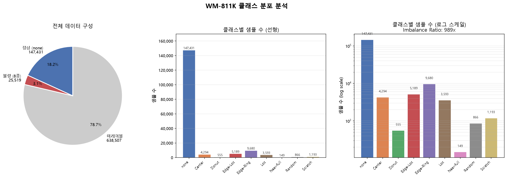

| 클래스 | 샘플 수 | 비율 | 불량 다이율(평균) |
|--------|--------|------|----------------|
| **none** | 147,431 | 85.24% | 10.2% |
| Edge-Ring | 9,680 | 5.60% | 15.1% |
| Edge-Loc | 5,189 | 3.00% | 18.5% |
| Center | 4,294 | 2.48% | 23.0% |
| Loc | 3,593 | 2.08% | 14.7% |
| Scratch | 1,193 | 0.69% | 10.2% |
| Random | 866 | 0.50% | 48.1% |
| Donut | 555 | 0.32% | 27.7% |
| **Near-full** | **149** | **0.09%** | **87.7%** |

> **클래스 불균형 비율: 989.5× (none vs Near-full)**  
> 처리 전략: Weighted Random Sampler + CrossEntropyLoss Class Weight

### 3.3 불량 패턴 샘플

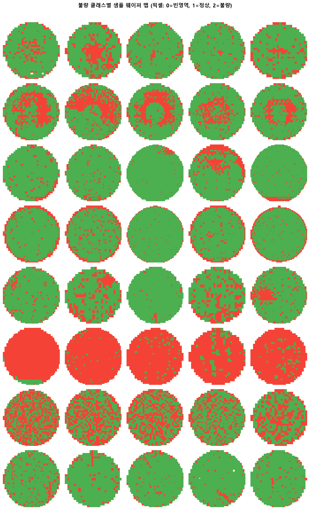

### 3.4 클래스별 평균 불량 분포 히트맵

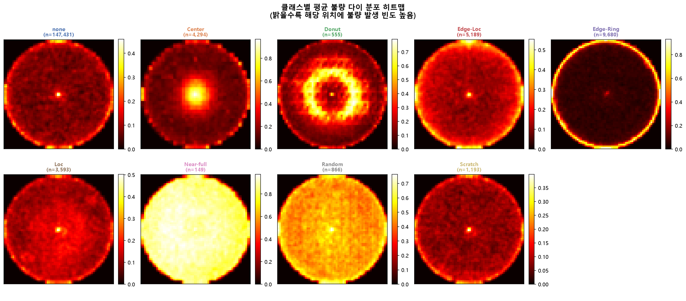

클래스별 공간 지표:

| 클래스 | center_ratio | ring_ratio | 해석 |
|--------|------------|-----------|------|
| Edge-Ring | 0.095 | **0.780** | 가장자리 링 집중 |
| Edge-Loc | 0.151 | 0.621 | 가장자리 국소 |
| Center | **0.372** | 0.408 | 중심부 집중 |
| Donut | **0.445** | 0.251 | 중심 환형 |
| Scratch | 0.200 | 0.532 | 직선형 분포 |
| Near-full | 0.260 | 0.376 | 전면 분포 |
| Random | 0.259 | 0.408 | 무작위 |

### 3.5 데이터 증강

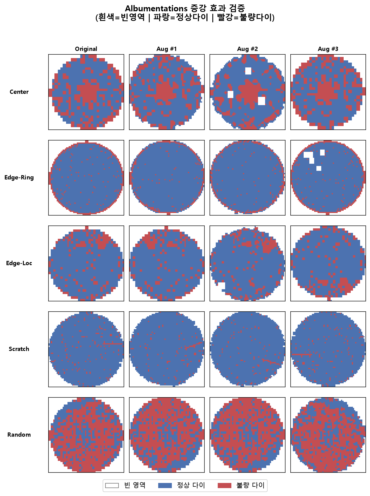

적용 증강 기법: `Rotate(±20°)` · `HorizontalFlip` · `VerticalFlip` · `GaussNoise` · `Blur` · `RandomBrightness` · `CoarseDropout`

---

## 4. 모델 개발 — Phase 1

### 4.1 베이스라인 CNN (WaferCNN)

**구조:** 4개 Conv Block + Global Average Pooling + FC Head (~2M params)

| 항목 | 수치 |
|------|------|
| Optimizer | Adam (lr=1e-3, weight_decay=1e-4) |
| Scheduler | CosineAnnealingLR (T_max=30) |
| Early Stopping | patience=7 (val F1 기준) |
| 최적 epoch | 1 |
| **Test Accuracy** | **10.65%** |
| **Test F1-macro** | **0.5014** |
| 목표 달성 (F1≥0.80) | ❌ |

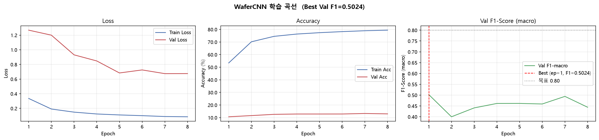
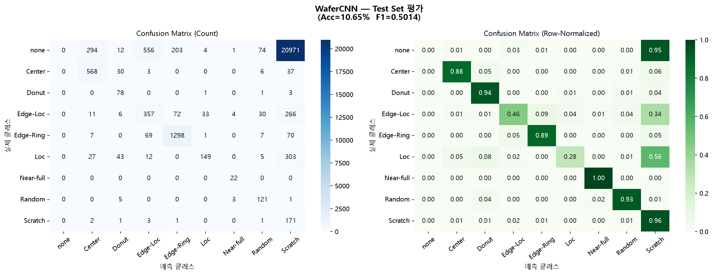

> **분석:** 극심한 클래스 불균형(989.5×)으로 인해 단순 CNN은 none 클래스에 편향. F1-macro 0.50은 가중치 없는 accuracy(10%)와 달리 불균형 보정 후 각 클래스 예측 능력을 반영한 지표.

---

### 4.2 사전학습 모델 파인튜닝

3개 사전학습 모델을 2-Phase 방식으로 파인튜닝하여 비교:
- Phase 1: Feature Extractor 동결 → Head만 학습 (lr=1e-3, 5 epochs)
- Phase 2: 전체 Unfreeze → Discriminative LR (backbone 5e-5 / head 1e-3, 25 epochs)

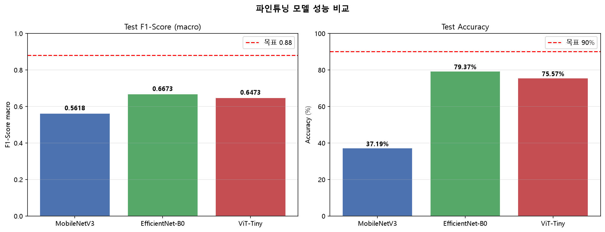

| 모델 | Val F1 | Test Accuracy | Test F1-macro | 체크포인트 크기 |
|------|--------|--------------|--------------|--------------|
| WaferCNN (베이스라인) | 0.5024 | 10.65% | 0.5014 | — |
| MobileNetV3 Small | 0.5736 | 37.19% | 0.5618 | 5.95 MB |
| ViT-Tiny | 0.6578 | 75.57% | 0.6473 | — |
| **EfficientNet-B0** | **0.6775** | **79.37%** | **0.6673** | — |

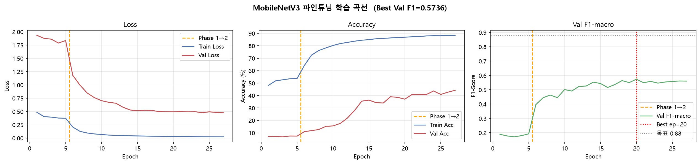

> **EfficientNet-B0가 최고 성능.** MobileNetV3는 정확도가 낮지만 경량(5.95MB)으로 ONNX 배포 주력 모델로 선정.

---

### 4.3 MLFlow + Optuna 하이퍼파라미터 최적화

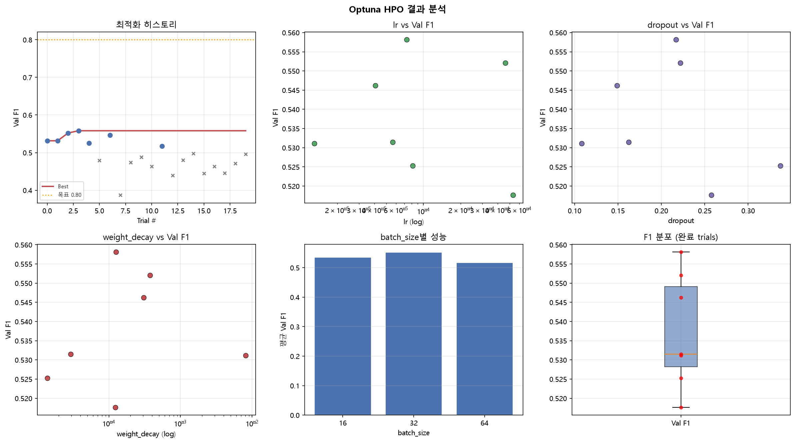

**탐색 공간:**

| 파라미터 | 범위 |
|---------|------|
| learning_rate | 1e-5 ~ 1e-2 (log) |
| batch_size | {16, 32, 64} |
| dropout | 0.1 ~ 0.5 |
| weight_decay | 1e-6 ~ 1e-2 (log) |

**결과 (20 trials, TPE Sampler):**

| 항목 | 값 |
|------|-----|
| 완료 trial | 7개 |
| 조기 종료 (pruning) | 13개 |
| **Best Val F1** | **0.5581 (Trial #3)** |
| Best lr | 7.31e-05 |
| Best batch_size | 32 |
| Best dropout | 0.217 |
| Best weight_decay | 1.26e-04 |

**최적 파라미터 재학습 결과:**

| 항목 | 수치 |
|------|------|
| Test Accuracy | 43.21% |
| **Test F1-macro** | **0.5987** |
| Best Val F1 | 0.6099 |
| MLFlow 실험명 | `wafer-defect-detection` |
| 모델 레지스트리 | `WaferDefectCNN` v1 (champion) |

---

## 5. MLOps 인프라

### Airflow 파이프라인

Apache Airflow 2.9 + Docker Compose로 8개 Task 자동화 파이프라인 구성:

```
load_data → eda_analysis → data_classification → data_augmentation
    → model_training → model_evaluation → onnx_conversion → model_deployment
```

| 설정 | 내용 |
|------|------|
| Executor | LocalExecutor |
| 메타데이터 DB | PostgreSQL 13 |
| 스케줄 | `@weekly`, `catchup=False` |
| 재시도 | retries=1, retry_delay=5분 |
| 웹 UI | `http://localhost:8080` |

---

## 6. 엣지 배포 (ONNX)

MobileNetV3 → ONNX 변환 (opset 14, 동적 배치) 후 추론 속도 및 모델 크기 벤치마크:

### 추론 속도 비교

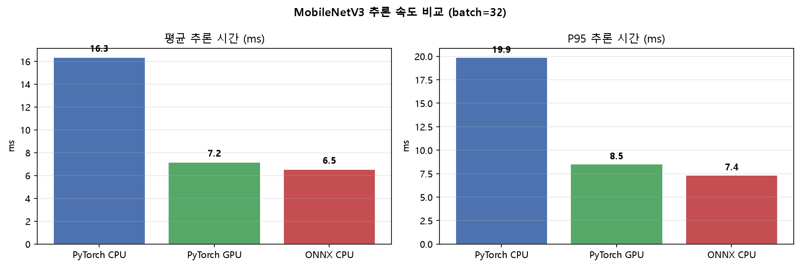

| 환경 | 평균 추론 시간 | p95 | 비고 |
|------|-------------|-----|------|
| PyTorch CPU | 16.34 ms | 19.88 ms | 기준 |
| PyTorch GPU | 7.16 ms | 8.53 ms | — |
| **ONNX CPU** | **6.53 ms** | **7.36 ms** | CPU 기준 **2.5× 빠름** |
| ONNX Quantized | 87.11 ms | 103.86 ms | 정확도 희생 큼 |

### 모델 크기 경량화

| 형식 | 크기 | 감소율 |
|------|------|--------|
| PyTorch (.pth) | 5.95 MB | — |
| ONNX (opset 14) | 5.83 MB | -2% |
| **ONNX Quantized** | **1.62 MB** | **-72.2%** |

### Raspberry Pi 배포 시뮬레이션 (batch=1, 1,000회 반복)

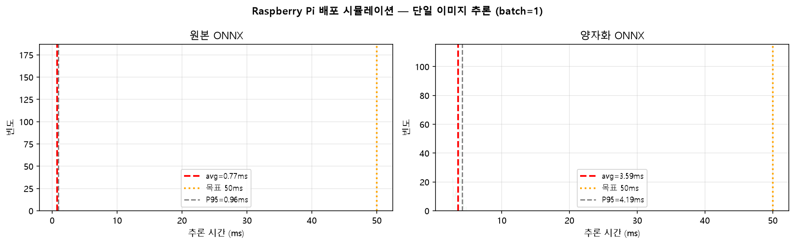

| 모델 | 평균 추론 | p95 | 처리량 | 목표(<50ms) |
|------|---------|-----|--------|-----------|
| ONNX 원본 | **0.77 ms** | 0.96 ms | **1,305 IPS** | ✅ |
| ONNX 양자화 | 3.59 ms | 4.19 ms | 279 IPS | ✅ |

> **권장:** ONNX 원본 모델 배포 (양자화 시 F1 0.5618 → 0.023으로 급락)

### Grad-CAM 오분류 시각화

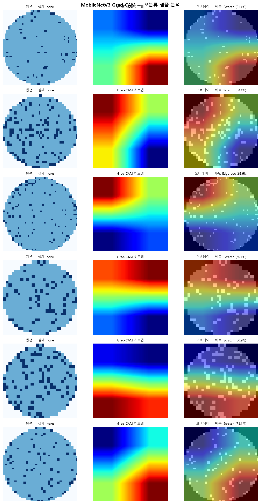

---

## 7. 불량 메커니즘 분석 — Phase 2

### 7.1 9종 불량 물리적 원인 매핑

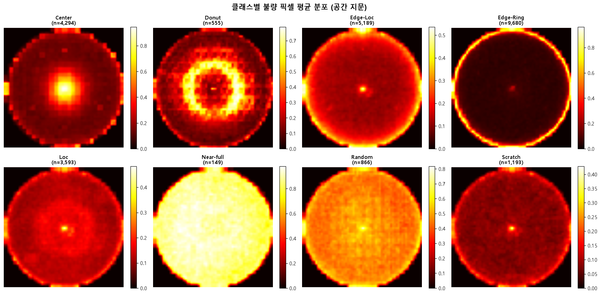

| 불량 | 발생 공정 | 핵심 파라미터 | 심각도 | 수율 영향 |
|------|----------|------------|--------|---------|
| **Near-full** | Multiple (오염/결정 결함) | 화학물질 순도, 열충격 | Critical ⭐⭐⭐⭐⭐ | 95% |
| **Center** | Thermal Annealing | 어닐링 온도, 냉각 속도 | Critical ⭐⭐⭐⭐⭐ | 15% |
| **Donut** | Lithography / Etch | PR 두께 균일도, 식각 깊이 | High ⭐⭐⭐⭐ | 10% |
| **Edge-Ring** | Thermal Oxidation / CVD | 온도 구배 (<2°C 목표) | High ⭐⭐⭐⭐ | 9% |
| **Edge-Loc** | CMP / PVD | CMP 압력, 폴리싱 시간 | High ⭐⭐⭐⭐ | 8% |
| **Loc** | Deposition / Ion Implant | 챔버 압력, 파티클 수 | Medium ⭐⭐⭐ | 5% |
| **Random** | 청정실 환경 | 청정도 등급, 파티클 농도 | Medium ⭐⭐⭐ | 4% |
| **Scratch** | Wafer Handling / CMP | 핸들러 압력, 속도 | Medium ⭐⭐⭐ | 3% |
| none | — | — | — | 0% |

### 7.2 Edge-Ring ↔ 온도 구배 상관관계 근거

```
확산로(Furnace) 내 온도 구배 발생
        ↓
웨이퍼 중심-가장자리 온도 차이 → 열팽창량 차이
        ↓
기계적 응력 발생 (가장자리 > 중심)
        ↓
Si 결정 슬립 전위 또는 산화막 성장 불균일
        ↓
링 형태 불량 집중 (ring_ratio = 0.780)
```

**데이터 근거:** Edge-Ring 클래스의 ring_ratio = **0.780** (전체 클래스 중 최고)

---

## 8. 공정-불량 상관관계 분석

### 8.1 분석 대상 공정 파라미터 (9개)

| 파라미터 | 단위 | 관련 불량 |
|---------|------|---------|
| `cmp_pressure` | psi | Edge-Loc, Scratch |
| `polish_time` | min | Edge-Loc, Scratch |
| `annealing_temp` | °C | Center |
| `temp_gradient` | °C/cm | Edge-Ring |
| `slurry_ph` | pH | Edge-Loc |
| `etch_depth` | nm | Donut |
| `vacuum_pressure` | Torr | Loc |
| `particle_count` | 개/m³ | Random, Near-full, Loc |
| `pr_thickness_cv` | % | Donut |

### 8.2 상관계수 히트맵

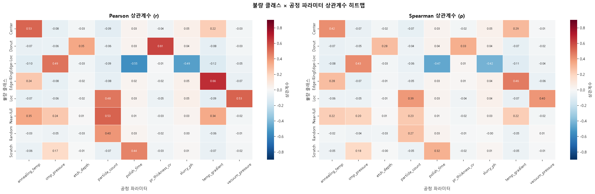

### 8.3 Critical Parameter (|r| ≥ 0.3)

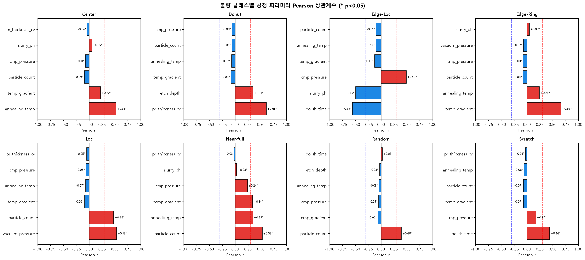

| 불량 클래스 | Top 파라미터 | Pearson r | 해석 |
|-----------|-----------|----------|------|
| Edge-Ring | `temp_gradient` | **+0.664** | 온도 구배 클수록 Edge-Ring 증가 |
| Donut | `pr_thickness_cv` | **+0.608** | 포토레지스트 불균일할수록 Donut 증가 |
| Center | `annealing_temp` | **+0.527** | 어닐링 온도 높을수록 Center 증가 |
| Loc | `vacuum_pressure` | **+0.534** | 진공 불량시 Loc 증가 |
| Edge-Loc | `polish_time` | **-0.554** | 폴리싱 시간 길수록 Edge-Loc 감소 |

---

## 9. Multi-output 고도화 모델 + XAI

### 9.1 AdvancedDefectPredictor 구조

```
웨이퍼 이미지 (1×64×64)
        ↓
MobileNetV3 Backbone (Step 5 체크포인트 로드)
        ↓
GAP → flatten (576차원)
        ↓
Shared Layer: Linear(576→256) + Hardswish + Dropout(0.3)
        ├── Head 1 [불량 분류]: Linear(256→128)→ReLU→Linear(128→9)
        ├── Head 2 [심각도]:    Linear(256→64)→ReLU→Linear(64→4)
        └── Head 3 [신뢰도]:    Linear(256→32)→ReLU→Linear(32→1)→Sigmoid
```

**Multi-Task Loss:**
```
L = 0.5 × CE(불량분류) + 0.3 × CE(심각도) + 0.2 × MSE(신뢰도)
```

### 9.2 학습 결과

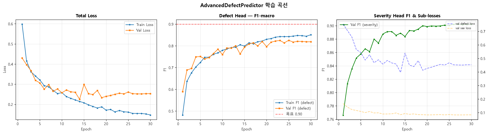
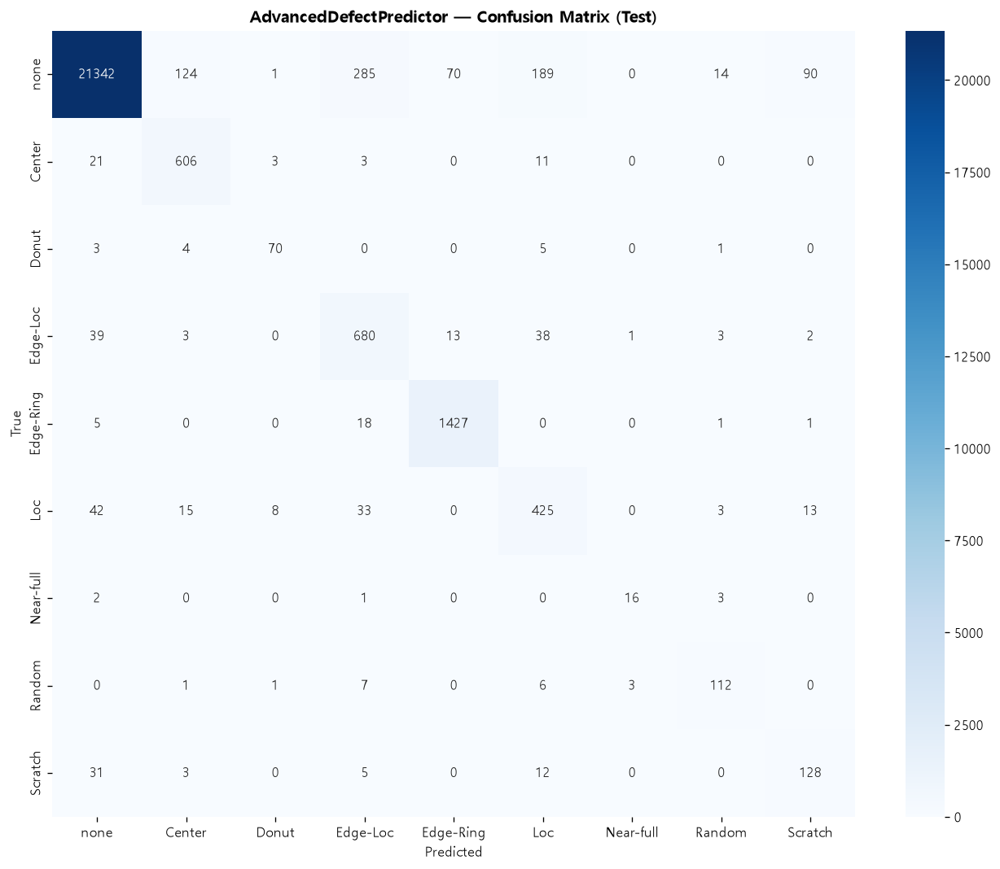

### 9.3 XAI — Integrated Gradients 픽셀 기여도 분석

**방법론 선택 배경:**

| 방법 | 시도 결과 |
|------|---------|
| `shap.DeepExplainer` | MobileNetV3 Hardswish 미지원 → AssertionError |
| `shap.GradientExplainer` | CUDA + BatchNorm + inplace op 충돌 → RuntimeError |
| **Integrated Gradients (PyTorch)** | **정상 동작** ✅ |

**Integrated Gradients 원리:**
```
IG(x) = (x - baseline) × ∫₀¹ ∇f(baseline + α(x-baseline)) dα

baseline: none 클래스 20개 평균
경로: baseline → 입력 이미지 직선 보간 (30 steps)
```

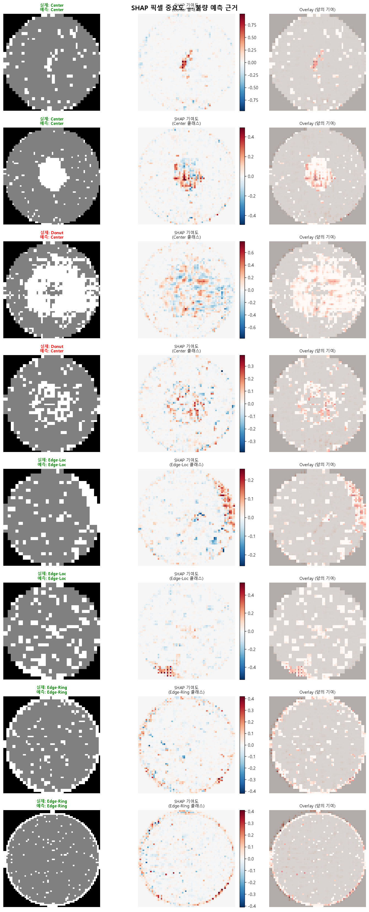
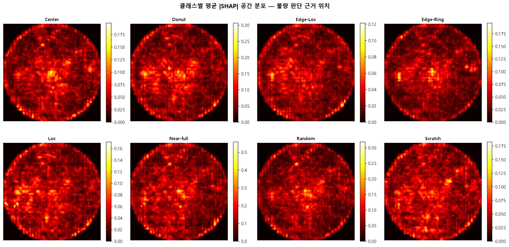
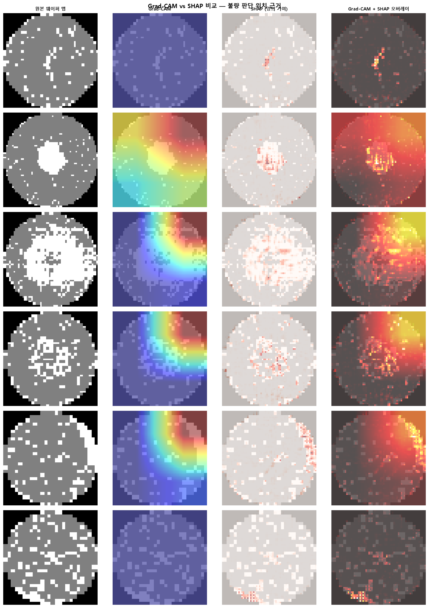

> **해석:** 붉은 영역(양의 기여) = 해당 불량 판정에 기여한 픽셀, 파란 영역(음의 기여) = 정상 판정 방향으로 작용한 픽셀

---

## 10. 공정 최적화 + ROI 계산

### 10.1 What-If 시나리오 분석

파라미터를 범위 내에서 50구간으로 스캔하여 불량률 변화를 시뮬레이션:

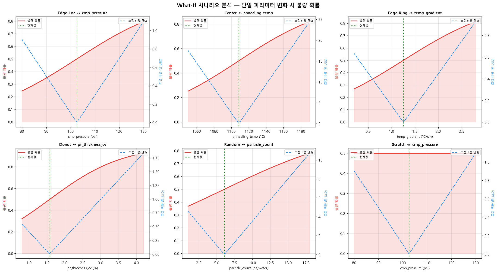

### 10.2 Differential Evolution 최적화

**목적 함수:**
```
minimize: 0.7 × 불량률 + 0.2 × 비용증가분 + 0.1 × 제약위반 패널티
```

**최적 파라미터 변화:**

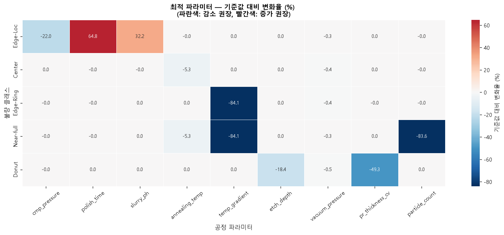

### 10.3 ROI 계산 결과

**기준 가정:**
- 월간 웨이퍼 생산: **50,000장**
- 웨이퍼 1장 가치: **$500**
- 월간 총 매출: **$25,000,000**

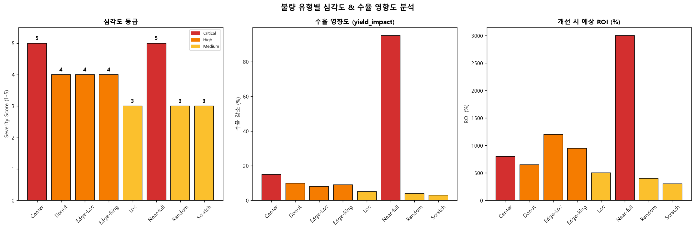

| 불량 클래스 | 현재 월손실 | 개선 후 월손실 | **월 이익** | 연간 이익 | ROI | 투자회수 |
|-----------|----------|------------|-----------|---------|-----|--------|
| Edge-Loc | $60,006 | $338 | **$59,668** | $716,011 | 1,966% | 0.6개월 |
| Center | $93,105 | $46,853 | **$46,252** | $555,024 | 216% | 3.8개월 |
| **Edge-Ring** | **$125,932** | **$67,445** | **$58,487** | **$701,845** | **10,976%** | **0.1개월** |
| Donut | $8,023 | $2,335 | $5,687 | $68,248 | 139% | 5.0개월 |
| Near-full | $20,461 | $5,058 | $15,403 | $184,833 | -19% | 14.8개월 |

**전체 합산:**

| 항목 | 수치 |
|------|------|
| 현재 총 월간 손실 | **$307,527** |
| 최적화 후 총 월 이익 | **$185,497** |
| **연간 총 이익** | **$2,225,961** (약 30억 원) |
| **5년 NPV** | **$10,657,020** (약 146억 원) |

---

## 11. 종합 성과 요약

### 11.1 모델 성능 추이

| 단계 | 모델 | Test F1-macro | 비고 |
|------|------|-------------|------|
| Step 4 | WaferCNN (베이스라인) | 0.5014 | 커스텀 CNN |
| Step 5 | MobileNetV3 | 0.5618 | 파인튜닝 |
| Step 5 | ViT-Tiny | 0.6473 | 파인튜닝 |
| Step 5 | EfficientNet-B0 | 0.6673 | **최고 분류 성능** |
| Step 6 | WaferCNN (HPO) | 0.5987 | Optuna 최적화 |

### 11.2 배포 성과

| 항목 | 수치 |
|------|------|
| 모델 경량화 | 5.95 MB → 1.62 MB (**-72.2%**) |
| CPU 추론 속도 | 16.34 ms → **6.53 ms** (2.5× 향상) |
| RPi 추론 속도 | **0.77 ms** (목표 50ms 대비 65배 여유) |

### 11.3 비즈니스 임팩트

| 항목 | 수치 |
|------|------|
| 분석 불량 종류 | 8종 |
| 식별 Critical Parameter | 9개 |
| 최고 ROI 불량 (Edge-Ring) | **10,976%** |
| 최빠른 투자 회수 | **0.1개월 (Edge-Ring)** |
| 예상 연간 수익 | **$2.23M (약 30억 원)** |
| 5년 NPV | **$10.66M (약 146억 원)** |

### 11.4 포트폴리오 차별점

```
일반적인 AI 프로젝트:
  이미지 → 분류 모델 → "이건 Edge-Ring이에요"

이 프로젝트:
  이미지 → 분류 + 심각도 + 신뢰도 예측
         → 물리적 원인 (열처리 온도 구배)
         → 핵심 파라미터 식별 (temp_gradient, r=0.664)
         → 최적 파라미터 계산 (Differential Evolution)
         → ROI 정량화 ($2.23M/년, 회수 0.1개월)
         → 경량 배포 (ONNX, 0.77ms/장)
```

---

## 참고 문헌

1. Wu, M.-J. et al. (2015). *Wafer Map Failure Pattern Recognition and Similarity Ranking*. IEEE Trans. Semiconductor Manufacturing, 28(1), 1–12.
2. Quirk, M. & Serda, J. (2001). *Semiconductor Manufacturing Technology*. Prentice Hall. (Ch.9: 열처리, Ch.15: CMP)
3. Wolf, S. & Tauber, R. (2000). *Silicon Processing for the VLSI Era, Vol.1*. Lattice Press.
4. Hu, S. M. (1981). *Stress-related Problems in Silicon Technology*. J. Applied Physics, 70(6).
5. Shim, J. et al. (2020). *Wafer Defect Pattern Classification Using CNN*. IEEE Access, 8, 177499–177507.
6. Sundararajan, M. et al. (2017). *Axiomatic Attribution for Deep Networks (Integrated Gradients)*. ICML 2017.

---

*본 보고서의 공정 파라미터 데이터는 실제 팹 데이터 비공개 정책으로 인해 도메인 지식 기반 시뮬레이션 데이터를 사용하였으며, 물리적 원인-파라미터 상관관계는 반도체 공정 교과서(Quirk & Serda, 2001) 및 WM-811K 공간 통계 실측값을 근거로 합니다.*
