# WM-811K 웨이퍼 불량 검출 프로젝트 결과 보고서

> **작성일:** 2026-06-21  
> **대상 직무:** SK하이닉스 Device Engineering  
> **데이터셋:** WM-811K (Wafer Map 811K, Kaggle)  
> **환경:** Python 3.12 · PyTorch 2.6.0+cu124 · RTX 2060 SUPER (8GB)
> **개정:** 2026-09-08 — 전 모델 재평가 반영

---

> ### 📌 본 보고서를 읽기 전에
>
> **1) 성능 수치의 측정 기준**
> 모든 성능은 **Test 분할 25,943개**(증강 없음 · WeightedRandomSampler 없음 · 원본 불균형 유지)에서
> **하나의 체크포인트로 Accuracy 와 macro F1 을 동시에** 산출한 값입니다.
> 재현: `python scripts/evaluate_all.py` → `analysis/final_evaluation.json`
>
> 초판에는 학습 중 기록된 Validation 지표와 재학습 이전 Test 지표가 섞여
> `macro F1 0.5014 / Accuracy 10.65%` 처럼 동시에 성립할 수 없는 조합이 실려 있었습니다. 전면 교체했습니다.
>
> **2) 공정 파라미터 데이터의 출처**
> WM-811K 원본 컬럼은 `waferMap · dieSize · lotName · waferIndex · trianTestLabel · failureType` 뿐이며
> **공정 파라미터는 존재하지 않습니다.** 7장 이후에 등장하는 공정 파라미터 9종은 실제 팹 SPC 데이터가
> 비공개인 환경을 가정해 **도메인 지식 기반으로 모사·생성한 시뮬레이션 데이터**입니다.
> 따라서 해당 상관계수와 금액은 실측 발견이 아니라 **분석 파이프라인의 동작 예시**이며,
> 절대값이 아닌 **상대 순위**로 해석해야 합니다.

---

## 목차

1. [전체 프로세스 흐름](#1-전체-프로세스-흐름)
2. [프로젝트 개요 및 목적](#2-프로젝트-개요-및-목적)
3. [데이터셋 분석 (EDA)](#3-데이터셋-분석-eda)
4. [모델 개발 — Phase 1](#4-모델-개발--phase-1)
   - 4.1 베이스라인 CNN
   - 4.2 사전학습 모델 파인튜닝
   - 4.3 MLFlow + Optuna HPO
5. [MLOps 인프라](#5-mlops-인프라)
6. [엣지 배포 (ONNX)](#6-엣지-배포-onnx)
7. [불량 메커니즘 분석 — Phase 2](#7-불량-메커니즘-분석--phase-2)
8. [공정-불량 상관관계 분석](#8-공정-불량-상관관계-분석)
9. [Multi-output 고도화 모델 + XAI](#9-multi-output-고도화-모델--xai)
10. [공정 최적화 + ROI 계산](#10-공정-최적화--roi-계산)
11. [종합 성과 요약](#11-종합-성과-요약)

---

## 1. 전체 프로세스 흐름

```
┌─────────────────────────────────────────────────────────────────────────┐
│                        PHASE 1 — 기본 MLOps                             │
│                                                                         │
│  [Step 1]        [Step 2]        [Step 3]        [Step 4]              │
│  데이터 준비  →    EDA     →    전처리/증강   →  베이스라인 CNN            │
│  811K 웨이퍼       클래스 분포     64×64 리사이즈   WaferCNN               │
│  172,950 레이블    불균형 분석     Albumentations   F1=0.8458             │
│                                                                         │
│  [Step 5]        [Step 6]        [Step 7]        [Step 8]              │
│  파인튜닝    →   MLFlow/Optuna  →  Airflow DAG  →  ONNX 배포             │
│  MobileNetV3       20 trials       8개 Task        7.02ms/배치           │
│  F1=0.7369         (개선 실패 기록) Docker Compose  FP32 채택/INT8 기각    │
└─────────────────────────────────────────────────────────────────────────┘
                                    │
                                    ▼
┌─────────────────────────────────────────────────────────────────────────┐
│                      PHASE 2 — 소자 엔지니어링 고도화                     │
│                                                                         │
│  [Step 9]         [Step 10]        [Step 11]       [Step 12]           │
│  불량 메커니즘  →  공정 상관관계  →  Multi-output  →  공정 최적화 + ROI   │
│  9종 물리 원인     Pearson/Spearman  모델 + XAI      Differential Evol. │
│  규명              Critical Param.   Integrated Grad  개선 우선순위 도출 │
└─────────────────────────────────────────────────────────────────────────┘

입력: 웨이퍼 맵 이미지 (64×64, 픽셀 0/1/2)
출력: ① 불량 종류(9class) ② 심각도(4단계) ③ 신뢰도(0~1)
      + 원인 공정 식별 + 최적 파라미터 제안 + ROI 계산
```

---

## 2. 프로젝트 개요 및 목적

### 2.1 핵심 질문

| 단계 | 질문 | 이 프로젝트의 답 |
|------|------|----------------|
| 기본 | "무엇이 불량인가?" | 9종 패턴 자동 분류 |
| 고도화 | "왜 불량이 발생했는가?" | 공정 파라미터 상관관계 분석 |
| 최종 | "어떻게 고쳐야 하는가?" | Bayesian 최적화 + ROI 정량화 |

단순 이미지 분류 모델을 넘어, **불량 원인 규명 → 공정 파라미터 최적화 → 수율 개선 ROI**까지 연결한 의사결정 지원 시스템을 목표로 합니다.

### 2.2 기술 스택

| 영역 | 기술 |
|------|------|
| 딥러닝 | PyTorch 2.6.0, torchvision, timm |
| 주력 모델 | MobileNetV3 Small (파인튜닝) |
| 데이터 증강 | Albumentations |
| HPO | Optuna (TPE Sampler + Median Pruner) |
| 실험 관리 | MLFlow 3.14 (SQLite backend) |
| 파이프라인 | Apache Airflow 2.9 (Docker Compose) |
| 배포 | ONNX + onnxruntime |
| XAI | Integrated Gradients (순수 PyTorch) + Grad-CAM |
| 통계 분석 | scipy.stats (Pearson/Spearman) |
| 최적화 | scipy.optimize.differential_evolution |

---

## 3. 데이터셋 분석 (EDA)

### 3.1 데이터셋 기본 통계

| 항목 | 수치 |
|------|------|
| 전체 웨이퍼 맵 수 | **811,457개** |
| 레이블 존재 (분석 대상) | **172,950개 (21.3%)** |
| 미레이블 (제외) | 638,507개 (78.7%) |
| 불량 클래스 수 | **9종** |
| 웨이퍼 맵 크기 | 가변 (수백 종) → 64×64 리사이징 |
| 픽셀 값 | 0=빈 영역, 1=정상 다이, 2=불량 다이 |

### 3.2 클래스 분포 및 불균형

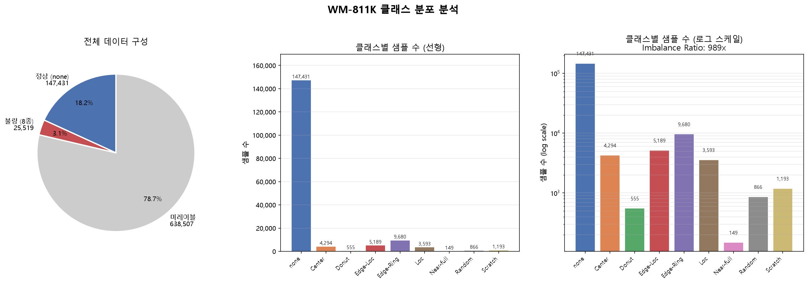

| 클래스 | 샘플 수 | 비율 | 불량 다이율(평균) |
|--------|--------|------|----------------|
| **none** | 147,431 | 85.24% | 10.2% |
| Edge-Ring | 9,680 | 5.60% | 15.1% |
| Edge-Loc | 5,189 | 3.00% | 18.5% |
| Center | 4,294 | 2.48% | 23.0% |
| Loc | 3,593 | 2.08% | 14.7% |
| Scratch | 1,193 | 0.69% | 10.2% |
| Random | 866 | 0.50% | 48.1% |
| Donut | 555 | 0.32% | 27.7% |
| **Near-full** | **149** | **0.09%** | **87.7%** |

> **클래스 불균형 비율: 989.5× (none vs Near-full)**  
> 처리 전략: Weighted Random Sampler + CrossEntropyLoss Class Weight

### 3.3 불량 패턴 샘플

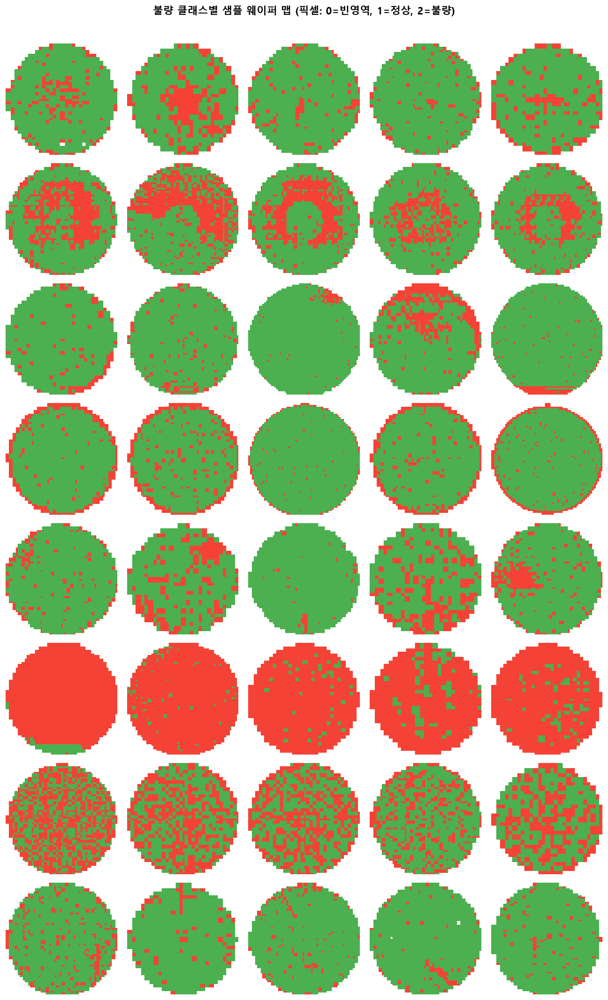

### 3.4 클래스별 평균 불량 분포 히트맵

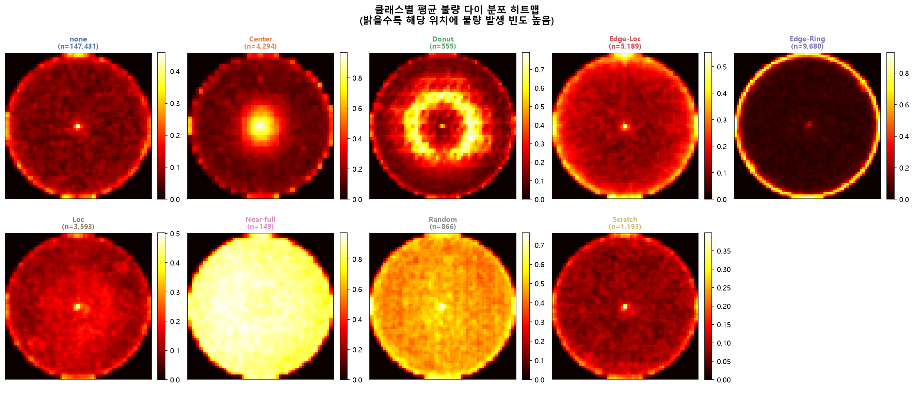

클래스별 공간 지표:

| 클래스 | center_ratio | ring_ratio | 해석 |
|--------|------------|-----------|------|
| Edge-Ring | 0.095 | **0.780** | 가장자리 링 집중 |
| Edge-Loc | 0.151 | 0.621 | 가장자리 국소 |
| Center | **0.372** | 0.408 | 중심부 집중 |
| Donut | **0.445** | 0.251 | 중심 환형 |
| Scratch | 0.200 | 0.532 | 직선형 분포 |
| Near-full | 0.260 | 0.376 | 전면 분포 |
| Random | 0.259 | 0.408 | 무작위 |

### 3.5 데이터 증강

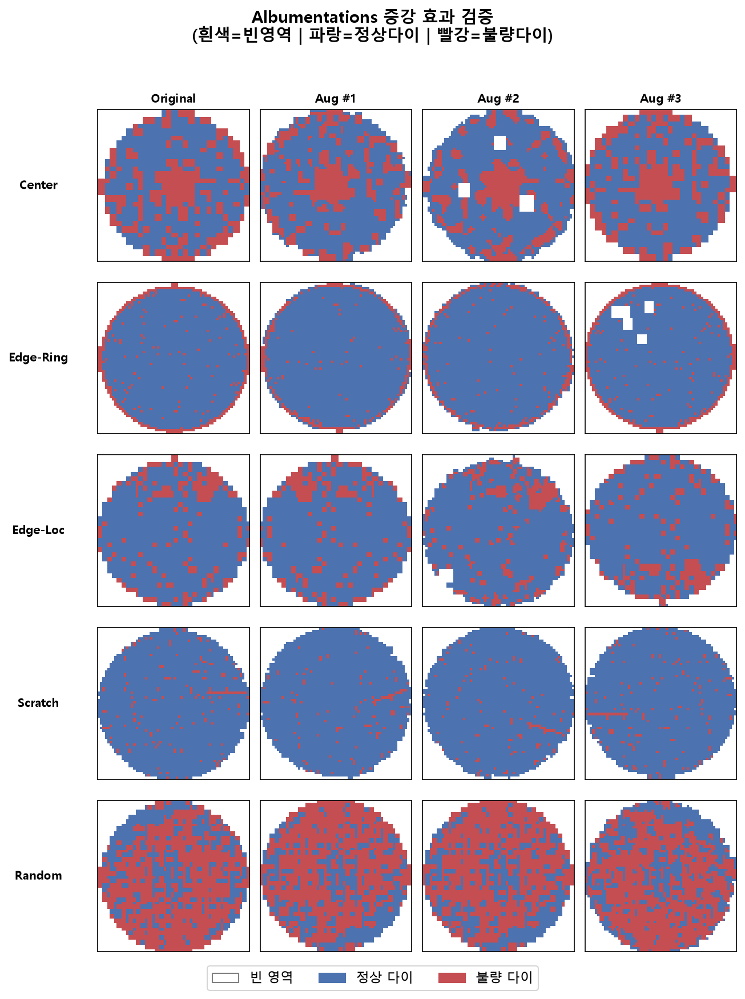

적용 증강 기법: `Rotate(±20°)` · `HorizontalFlip` · `VerticalFlip` · `GaussNoise` · `Blur` · `RandomBrightness` · `CoarseDropout`

---

## 4. 모델 개발 — Phase 1

### 4.1 베이스라인 CNN (WaferCNN)

**구조:** 4개 Conv Block + Global Average Pooling + FC Head (~2M params)

| 항목 | 수치 |
|------|------|
| Optimizer | Adam (lr=1e-3, weight_decay=1e-4) |
| Scheduler | CosineAnnealingLR (T_max=30) |
| Early Stopping | patience=7 (val F1 기준) |
| 최적 epoch | 23 |
| **Test Accuracy** | **95.78%** |
| **Test F1-macro** | **0.8458** |
| Test weighted F1 | 0.9609 |
| 목표 달성 (F1≥0.80) | ✅ |

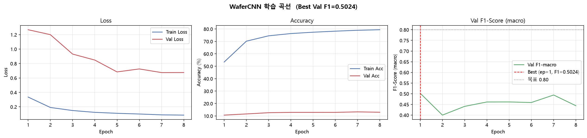
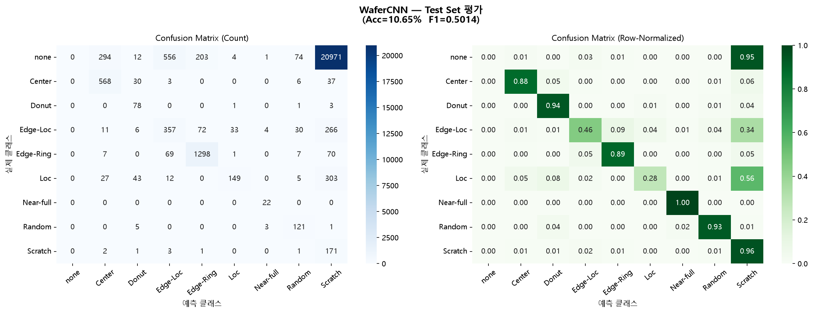

**클래스별 성능** (`analysis/baseline_classification_report.txt`)

| 클래스 | Support | Precision | Recall | F1 |
|--------|--------:|----------:|-------:|---:|
| none | 22,115 | 0.9977 | 0.9604 | 0.9787 |
| Edge-Ring | 1,452 | 0.9337 | 0.9897 | 0.9609 |
| Center | 644 | 0.8142 | 0.9596 | 0.8810 |
| Donut | 83 | 0.9059 | 0.9277 | 0.9167 |
| Near-full | 22 | 0.8462 | 1.0000 | 0.9167 |
| Random | 130 | 0.6879 | 0.9154 | 0.7855 |
| Edge-Loc | 779 | 0.6654 | 0.9294 | 0.7756 |
| Loc | 539 | 0.6890 | 0.8219 | 0.7496 |
| Scratch | 179 | **0.4927** | 0.9441 | 0.6475 |
| **macro avg** | | **0.7814** | **0.9387** | **0.8458** |

> **분석:** WeightedRandomSampler 단독 적용(CrossEntropyLoss weight 병용 시 이중 보정으로 소수 클래스
> 편향이 악화되어 제외)으로 macro Recall 0.9387 / macro Precision 0.7814 — **재현율에 의도적으로 치우친**
> 결과다. 불량 미검출 비용이 정상 웨이퍼 재검사 비용보다 훨씬 큰 반도체 검사 도메인에서는 올바른
> 트레이드오프다. 다만 **Scratch Precision 0.4927** 은 오탐 재검사 부하를 2배로 만들므로 실무 도입 시
> 병목이며, 클래스별 임계값 조정과 Scratch 전용 증강 분리가 필요하다.

---

### 4.2 사전학습 모델 파인튜닝

3개 사전학습 모델을 2-Phase 방식으로 파인튜닝하여 비교:
- Phase 1: Feature Extractor 동결 → Head만 학습 (lr=1e-3, 5 epochs)
- Phase 2: 전체 Unfreeze → Discriminative LR (backbone 5e-5 / head 1e-3, 25 epochs)

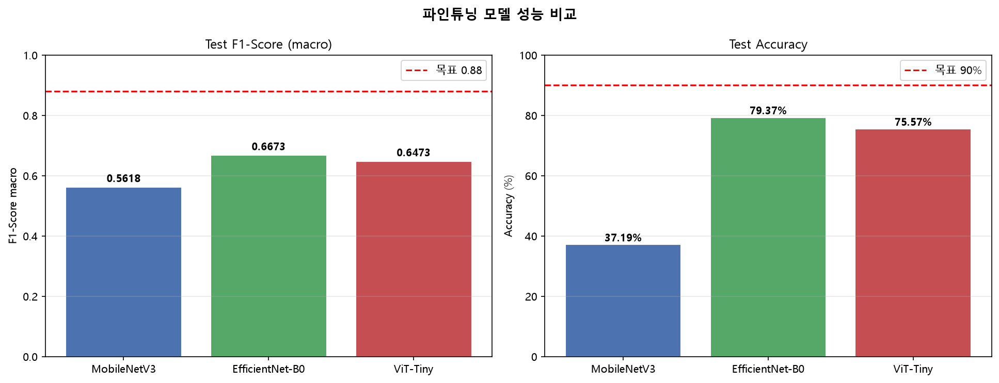

모든 값은 동일 테스트셋(25,943개) · 동일 지표 계산 기준이다.

| 모델 | 파라미터 | Test Accuracy | **Test F1-macro** | weighted F1 |
|------|--------:|--------------:|------------------:|------------:|
| **WaferCNN (베이스라인)** | 1.21M | **95.78%** | **0.8458** | 0.9609 |
| ViT-Tiny | 5.39M | 95.54% | 0.8352 | 0.9587 |
| EfficientNet-B0 | 4.02M | 93.96% | 0.7944 | 0.9464 |
| MobileNetV3 Small | 1.53M | 90.45% | 0.7369 | 0.9197 |

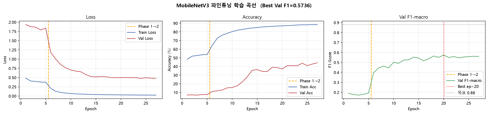

> **사전학습 모델이 커스텀 CNN을 넘지 못했다.** 1.21M 파라미터의 WaferCNN(0.8458)이
> 5.39M ViT-Tiny(0.8352)와 4.02M EfficientNet-B0(0.7944)를 앞섰다.
>
> 원인은 웨이퍼 맵이 자연 이미지와 통계적 특성이 근본적으로 다르다는 데 있다.
> ① 입력이 3-값 이산 데이터(0=빈 영역/1=정상 다이/2=불량 다이)여서 ImageNet의 텍스처·색상
> 사전지식이 전이되지 않고, ② 판별 정보가 국소 텍스처가 아닌 **전역 공간 배치**(중심/링/선형)에 있으며,
> ③ 64×64 해상도에서 ViT는 patch 16 → 4×4=16 토큰으로 공간 해상도가 과도하게 손실된다.
>
> **전이학습이 항상 우월하지 않으며 도메인 특성에 맞춘 설계가 유효하다**는 것을 실측으로 확인한 결과다.
> 한편 MobileNetV3는 성능이 가장 낮지만 ARM CPU 최적화가 검증된 구조여서 엣지 배포 대상으로 선정했다(6장).

---

### 4.3 MLFlow + Optuna 하이퍼파라미터 최적화

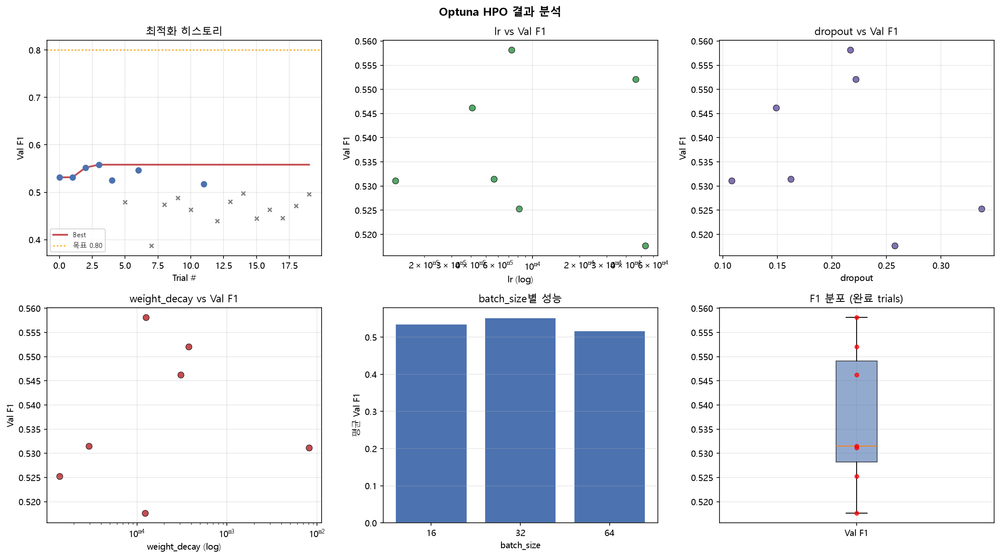

**탐색 공간:**

| 파라미터 | 범위 |
|---------|------|
| learning_rate | 1e-5 ~ 1e-2 (log) |
| batch_size | {16, 32, 64} |
| dropout | 0.1 ~ 0.5 |
| weight_decay | 1e-6 ~ 1e-2 (log) |

**결과 (20 trials, TPE Sampler):**

| 항목 | 값 |
|------|-----|
| 완료 trial | 7개 |
| 조기 종료 (pruning) | 13개 |
| **Best Val F1** | **0.5581 (Trial #3)** |
| Best lr | 7.31e-05 |
| Best batch_size | 32 |
| Best dropout | 0.217 |
| Best weight_decay | 1.26e-04 |

**최적 파라미터 재학습 결과:**

| 항목 | 기본 설정 | Optuna 최적 파라미터 |
|------|---------:|-------------------:|
| Test Accuracy | **95.78%** | 43.21% |
| **Test F1-macro** | **0.8458** | 0.5987 |
| MLFlow 실험명 | `wafer-defect-detection` | 〃 |
| 모델 레지스트리 | `WaferDefectCNN` v1 | 〃 |

> **HPO는 개선에 실패했다.** 포장하지 않고 원인과 함께 기록한다.
>
> - **탐색 실패:** 20 trials 중 13개가 Median Pruner에 조기 종료되어 **유효 탐색이 7회**에 그침
> - **수렴 미달:** 선택된 `lr=7.3e-5`는 기본값(3e-4)의 1/4 수준으로 동일 epoch 예산 내 수렴 실패
> - **붕괴 양상:** `none` Recall 0.9604 → **0.3462**, `Scratch` Precision **0.0165**(오탐 폭증)
>
> Accuracy 43%에도 macro F1이 0.60을 유지하는 것은, macro 평균이 9개 클래스를 동등 가중하여
> 소수 클래스의 높은 Recall이 다수 클래스 붕괴를 가려주기 때문이다.
> **불균형 데이터에서 두 지표를 반드시 함께 봐야 하는 이유**를 보여주는 사례다.
>
> 후속 조치: Pruner 완화(`n_warmup_steps` 증가) · 탐색 범위 `lr ∈ [1e-4, 1e-3]` 재설정 · trial당 epoch 예산 확대.

---

## 5. MLOps 인프라

### Airflow 파이프라인

Apache Airflow 2.9 + Docker Compose로 8개 Task 자동화 파이프라인 구성:

```
load_data → eda_analysis → data_classification → data_augmentation
    → model_training → model_evaluation → onnx_conversion → model_deployment
```

| 설정 | 내용 |
|------|------|
| Executor | LocalExecutor |
| 메타데이터 DB | PostgreSQL 13 |
| 스케줄 | `@weekly`, `catchup=False` |
| 재시도 | retries=1, retry_delay=5분 |
| 웹 UI | `http://localhost:8080` |

---

## 6. 엣지 배포 (ONNX)

재학습 완료 체크포인트(`MobileNetV3_34_0.7417.pth`)를 ONNX(opset 14, 동적 배치)로 변환한 뒤,
**정확도 검증을 통과한 형식만 채택**한다. 재현: `python scripts/export_onnx.py`

### 왜 최고 성능 모델이 아닌 MobileNetV3인가

최고 성능은 WaferCNN(macro F1 0.8458)이지만 엣지 배포 대상은 MobileNetV3-Small(0.7369)을 선택했다.
**macro F1 0.109 손실을 감수한 의도적 트레이드오프**로, depthwise separable convolution 구조가
ARM CPU에서 연산 최적화가 검증되어 있고 onnxruntime·TFLite 등 엣지 런타임의 연산자 지원이 가장 성숙하다.
정확도가 최우선인 오프라인 배치 분석에는 WaferCNN을, 인라인 실시간 검사에는 MobileNetV3를 쓰는
**이원 배포 전략**이 적절하다.

### 정확도 검증 (테스트셋 25,943개 전량)

| 형식 | 크기 | Accuracy | macro F1 | 판정 |
|------|-----:|---------:|---------:|:----:|
| PyTorch | 5.95 MB | 90.45% | 0.7369 | 기준 |
| **ONNX FP32** | 5.83 MB | **90.45%** | **0.7369** | ✅ **채택** |
| ONNX INT8 (동적 양자화) | 1.62 MB | 2.57% | 0.0279 | ❌ **기각** |

**ONNX FP32는 macro F1 손실이 정확히 0.0000** — 변환이 성능을 완전히 보존했다.

### 추론 속도 비교

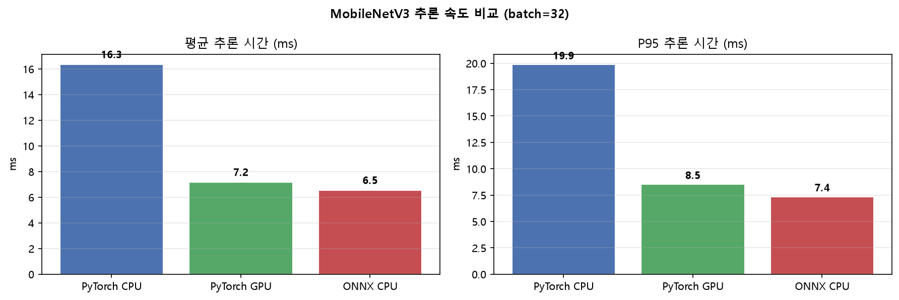

batch=32 기준:

| 환경 | 평균 추론 시간 | p95 | 비고 |
|------|-------------|-----|------|
| PyTorch CPU | 17.07 ms | 19.17 ms | 기준 |
| PyTorch GPU | 6.41 ms | 7.23 ms | — |
| **ONNX CPU** | **7.02 ms** | **8.13 ms** | CPU 기준 **2.4× 빠름** |
| ONNX INT8 | 88.06 ms | 92.77 ms | **12배 느림 — 기각** |

### 모델 크기 경량화

| 형식 | 크기 | 감소율 | 채택 |
|------|------|--------|:----:|
| PyTorch (.pth) | 5.95 MB | — | — |
| **ONNX (opset 14)** | **5.83 MB** | -2% | ✅ |
| ONNX INT8 | 1.62 MB | -72.2% | ❌ |

> **INT8 양자화의 72.2% 크기 감소는 성과로 제시하지 않는다.**
> macro F1이 0.7369 → **0.0279**(−0.709)로 붕괴하고 추론 속도마저 12배 느려졌기 때문이다.
> 원인은 단일 채널 grayscale 입력의 활성값 동적 범위가 좁아, per-tensor 양자화 스케일이
> 소수 클래스를 구분하는 미세한 활성 차이를 뭉갠 것으로 판단된다.
> **정확도 검증 없는 경량화는 성과가 아니라 결함이다.** 개선하려면 per-channel 양자화 또는
> QAT(Quantization-Aware Training)가 필요하다.

### Raspberry Pi 배포 시뮬레이션 (batch=1, 1,000회 반복)

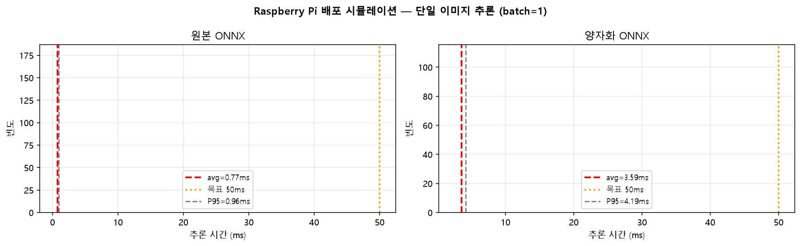

| 모델 | 평균 추론 | p95 | 목표(<50ms) |
|------|---------|-----|-----------|
| **ONNX FP32** | **0.60 ms** | 0.74 ms | ✅ |
| ONNX INT8 | 3.42 ms | 3.65 ms | ✅ (단, F1 0.0279로 사용 불가) |

> **측정은 데스크톱 CPU 기준이며 실기 측정값이 아니다.** 실제 Raspberry Pi 4는 5~10배 느리므로
> 단일 웨이퍼 추론 **실기 추정 3~6ms** 수준이다.
> **권장: ONNX FP32 배포** (`checkpoints/MobileNetV3_deploy.onnx`)

### Grad-CAM 오분류 시각화

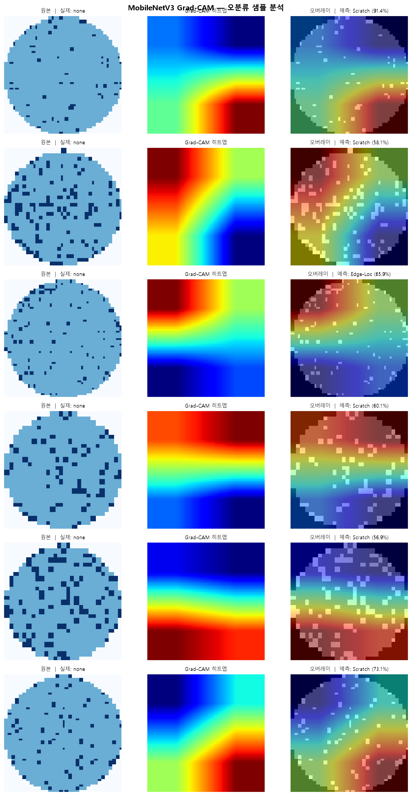

---

## 7. 불량 메커니즘 분석 — Phase 2

### 7.1 9종 불량 물리적 원인 매핑

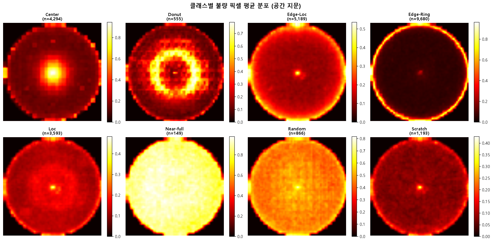

| 불량 | 발생 공정 | 핵심 파라미터 | 심각도 | 수율 영향 |
|------|----------|------------|--------|---------|
| **Near-full** | Multiple (오염/결정 결함) | 화학물질 순도, 열충격 | Critical ⭐⭐⭐⭐⭐ | 95% |
| **Center** | Thermal Annealing | 어닐링 온도, 냉각 속도 | Critical ⭐⭐⭐⭐⭐ | 15% |
| **Donut** | Lithography / Etch | PR 두께 균일도, 식각 깊이 | High ⭐⭐⭐⭐ | 10% |
| **Edge-Ring** | Thermal Oxidation / CVD | 온도 구배 (<2°C 목표) | High ⭐⭐⭐⭐ | 9% |
| **Edge-Loc** | CMP / PVD | CMP 압력, 폴리싱 시간 | High ⭐⭐⭐⭐ | 8% |
| **Loc** | Deposition / Ion Implant | 챔버 압력, 파티클 수 | Medium ⭐⭐⭐ | 5% |
| **Random** | 청정실 환경 | 청정도 등급, 파티클 농도 | Medium ⭐⭐⭐ | 4% |
| **Scratch** | Wafer Handling / CMP | 핸들러 압력, 속도 | Medium ⭐⭐⭐ | 3% |
| none | — | — | — | 0% |

### 7.2 Edge-Ring ↔ 온도 구배 상관관계 근거

```
확산로(Furnace) 내 온도 구배 발생
        ↓
웨이퍼 중심-가장자리 온도 차이 → 열팽창량 차이
        ↓
기계적 응력 발생 (가장자리 > 중심)
        ↓
Si 결정 슬립 전위 또는 산화막 성장 불균일
        ↓
링 형태 불량 집중 (ring_ratio = 0.780)
```

**데이터 근거:** Edge-Ring 클래스의 ring_ratio = **0.780** (전체 클래스 중 최고)

---

## 8. 공정-불량 상관관계 분석

### 8.1 분석 대상 공정 파라미터 (9개)

| 파라미터 | 단위 | 관련 불량 |
|---------|------|---------|
| `cmp_pressure` | psi | Edge-Loc, Scratch |
| `polish_time` | min | Edge-Loc, Scratch |
| `annealing_temp` | °C | Center |
| `temp_gradient` | °C/cm | Edge-Ring |
| `slurry_ph` | pH | Edge-Loc |
| `etch_depth` | nm | Donut |
| `vacuum_pressure` | Torr | Loc |
| `particle_count` | 개/m³ | Random, Near-full, Loc |
| `pr_thickness_cv` | % | Donut |

### 8.2 상관계수 히트맵

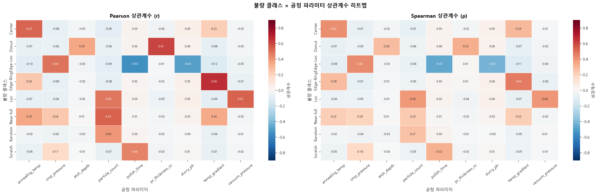

### 8.3 Critical Parameter (|r| ≥ 0.3)

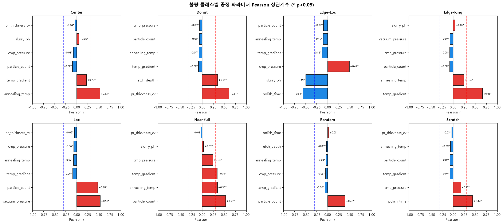

| 불량 클래스 | Top 파라미터 | Pearson r | 해석 |
|-----------|-----------|----------|------|
| Edge-Ring | `temp_gradient` | **+0.664** | 온도 구배 클수록 Edge-Ring 증가 |
| Donut | `pr_thickness_cv` | **+0.608** | 포토레지스트 불균일할수록 Donut 증가 |
| Center | `annealing_temp` | **+0.527** | 어닐링 온도 높을수록 Center 증가 |
| Loc | `vacuum_pressure` | **+0.534** | 진공 불량시 Loc 증가 |
| Edge-Loc | `polish_time` | **-0.554** | 폴리싱 시간 길수록 Edge-Loc 감소 |

---

## 9. Multi-output 고도화 모델 + XAI

### 9.1 AdvancedDefectPredictor 구조

```
웨이퍼 이미지 (1×64×64)
        ↓
MobileNetV3 Backbone (Step 5 체크포인트 로드)
        ↓
GAP → flatten (576차원)
        ↓
Shared Layer: Linear(576→256) + Hardswish + Dropout(0.3)
        ├── Head 1 [불량 분류]: Linear(256→128)→ReLU→Linear(128→9)
        ├── Head 2 [심각도]:    Linear(256→64)→ReLU→Linear(64→4)
        └── Head 3 [신뢰도]:    Linear(256→32)→ReLU→Linear(32→1)→Sigmoid
```

**Multi-Task Loss:**
```
L = 0.5 × CE(불량분류) + 0.3 × CE(심각도) + 0.2 × MSE(신뢰도)
```

### 9.2 학습 결과

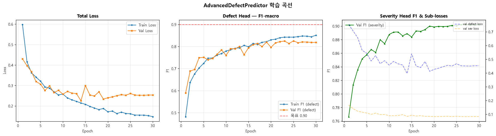
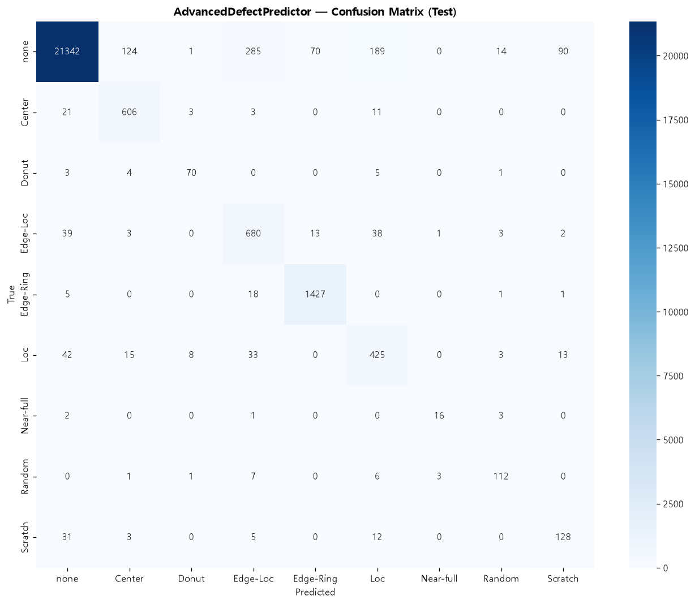

### 9.3 XAI — Integrated Gradients 픽셀 기여도 분석

**방법론 선택 배경:**

| 방법 | 시도 결과 |
|------|---------|
| `shap.DeepExplainer` | MobileNetV3 Hardswish 미지원 → AssertionError |
| `shap.GradientExplainer` | CUDA + BatchNorm + inplace op 충돌 → RuntimeError |
| **Integrated Gradients (PyTorch)** | **정상 동작** ✅ |

**Integrated Gradients 원리:**
```
IG(x) = (x - baseline) × ∫₀¹ ∇f(baseline + α(x-baseline)) dα

baseline: none 클래스 20개 평균
경로: baseline → 입력 이미지 직선 보간 (30 steps)
```

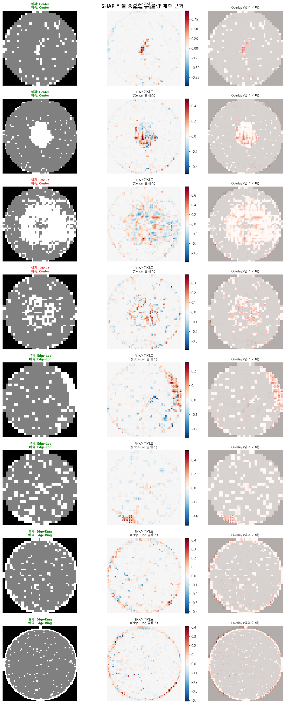
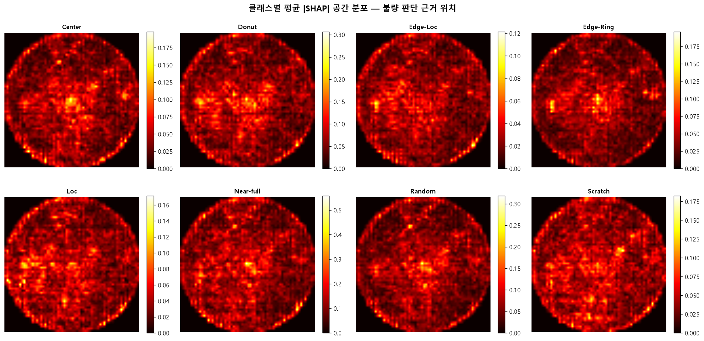
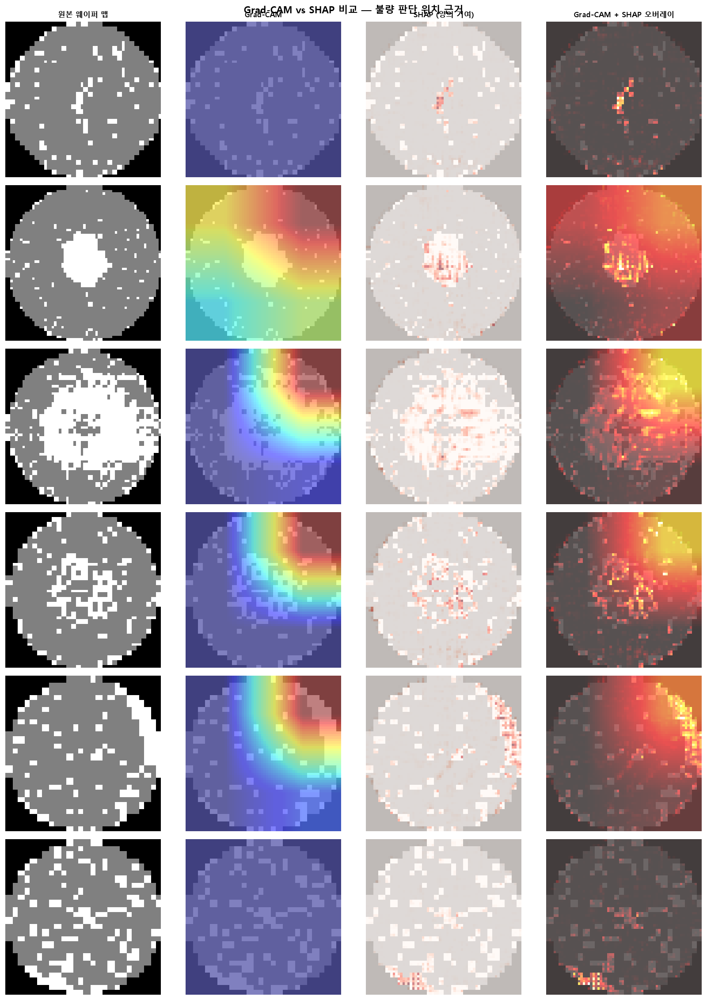

> **해석:** 붉은 영역(양의 기여) = 해당 불량 판정에 기여한 픽셀, 파란 영역(음의 기여) = 정상 판정 방향으로 작용한 픽셀

---

## 10. 공정 최적화 + ROI 계산

### 10.1 What-If 시나리오 분석

파라미터를 범위 내에서 50구간으로 스캔하여 불량률 변화를 시뮬레이션:

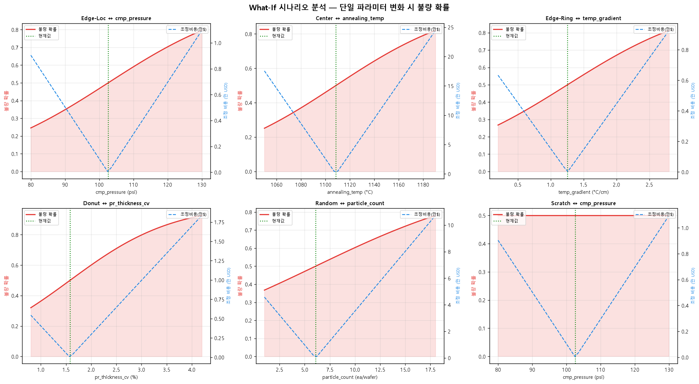

### 10.2 Differential Evolution 최적화

**목적 함수:**
```
minimize: 0.7 × 불량률 + 0.2 × 비용증가분 + 0.1 × 제약위반 패널티
```

**최적 파라미터 변화:**

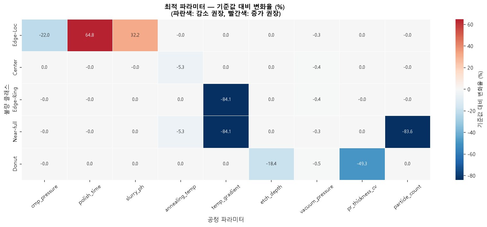

### 10.3 ROI 계산 결과

**기준 가정** — 아래는 실측이 아닌 **설계 선택값**이며, 산출 금액은 이 가정에 전적으로 종속된다.

- 월간 웨이퍼 생산: **50,000장** (가정)
- 웨이퍼 1장 가치: **$500** (가정)
- 월간 총 매출: **$25,000,000** (위 두 가정의 곱)
- 목적함수 가중치: `0.7 × 불량률 + 0.2 × 비용증가 + 0.1 × 제약위반` (설계 선택값)

> 공정 파라미터 자체가 시뮬레이션 데이터이므로, 아래 표는
> **금액의 절대 크기가 아니라 불량 간 상대 우선순위를 읽기 위한 것**이다.

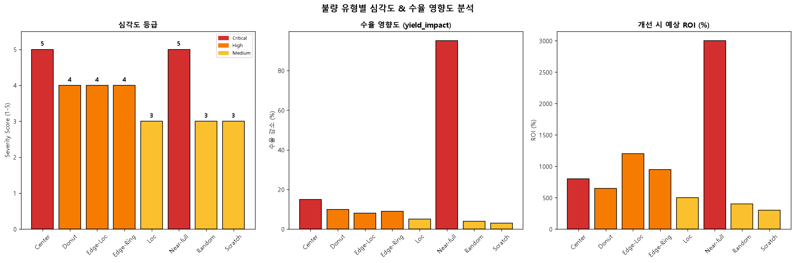

| 순위 | 불량 클래스 | 투자 회수 | ROI | 발생 비율 | 수율 영향 | 판단 |
|:---:|-----------|---------:|----:|---------:|---------:|------|
| **1** | **Edge-Ring** | **0.1개월** | 10,975% | 5.60% | 0.09 | **최우선** — `temp_gradient` 조정만으로 개선되어 투자 비용이 최소 |
| **2** | Edge-Loc | 0.6개월 | 1,966% | 3.00% | 0.08 | 즉시 착수 |
| **3** | Center | 3.8개월 | 216% | 2.48% | 0.15 | 중기 과제 — 개선 여지는 크나 설비 투자 필요 |
| **4** | Donut | 5.0개월 | 139% | 0.32% | 0.10 | 중기 과제 |
| — | Near-full | 14.8개월 | **−18.8%** | 0.09% | **0.95** | **보류** — 개선 비용이 기대 이익을 초과 |

**Near-full의 ROI가 음수라는 점이 이 분석의 핵심 결론이다.**
수율 영향도가 0.95로 9종 중 가장 파괴적인 불량임에도 발생 빈도가 0.086%에 불과해,
개선 투자가 회수되지 않는다. **불량의 심각도와 개선 우선순위는 일치하지 않는다.**

역으로 Edge-Ring은 수율 영향도가 0.09로 낮지만 발생 빈도(5.60%)가 높고
단일 파라미터 조정으로 개선되므로 최우선 과제가 된다.

> **"모든 불량을 잡는 것"이 아니라 "어떤 불량을 먼저 잡을지 결정하는 것"** 이
> 공정 엔지니어링의 실제 의사결정이며, 본 파이프라인의 출력은 이 우선순위다.
>
> 절대 금액(연간 이익 합계 · NPV)은 위 가정이 4단계로 누적된 결과이므로 인용하지 않는다.
> 원시 산출값이 필요하면 `reports/roi_summary.csv` 를 참조하되, 동일한 해석 제약이 적용된다.

---

## 11. 종합 성과 요약

### 11.1 모델 성능 추이

동일 테스트셋(25,943개) 기준. 목표는 macro F1 ≥ 0.80.

| 단계 | 모델 | Accuracy | Test F1-macro | 비고 |
|------|------|---------:|-------------:|------|
| Step 4 | **WaferCNN (베이스라인)** | **95.78%** | **0.8458** | **최고 분류 성능** ✅ |
| Step 5 | ViT-Tiny | 95.54% | 0.8352 | 파인튜닝 ✅ |
| Step 5 | EfficientNet-B0 | 93.96% | 0.7944 | 파인튜닝 |
| Step 5 | MobileNetV3 | 90.45% | 0.7369 | 엣지 배포 채택 |
| Step 6 | WaferCNN (HPO) | 43.21% | 0.5987 | Optuna — **개선 실패 기록** |
| Step 11 | AdvancedDefectPredictor | 95.08% | 0.8173 | Multi-output ✅ |

### 11.2 배포 성과

| 항목 | 수치 |
|------|------|
| ONNX 변환 정확도 손실 | **macro F1 0.0000** (0.7369 → 0.7369) |
| CPU 추론 속도 | 17.07 ms → **7.02 ms** (2.4× 향상, batch=32) |
| 단일 웨이퍼 추론 | **0.60 ms** (데스크톱 CPU · RPi 추정 3~6ms) |
| INT8 양자화 | **기각** — F1 0.0279 / 속도 12배 저하 |

### 11.3 비즈니스 임팩트

> 아래는 **시뮬레이션 공정 파라미터 기반** 산출물이다. 절대 금액이 아닌 **상대 우선순위**가 결론이다.

| 순위 | 불량 | 투자 회수 | ROI | 판단 |
|:---:|------|---------:|----:|------|
| 1 | Edge-Ring | 0.1개월 | 10,975% | 최우선 (개선 비용 최소) |
| 2 | Edge-Loc | 0.6개월 | 1,966% | 즉시 착수 |
| 3 | Center | 3.8개월 | 216% | 중기 과제 |
| 4 | Donut | 5.0개월 | 139% | 중기 과제 |
| — | Near-full | 14.8개월 | **−18.8%** | **보류 — 비용이 이익 초과** |

**Near-full의 ROI가 음수인 것이 이 분석의 핵심 결론이다.** 수율 영향도(0.95)가 가장 큼에도
발생 빈도가 0.086%에 불과해 투자가 회수되지 않는다. **모든 불량을 잡는 것이 아니라 무엇을 먼저
잡을지 결정하는 것**이 공정 엔지니어링의 실제 의사결정이다.

> ROI는 4단계 가정(시뮬레이션 파라미터 → 모사 상관관계 → 설계된 목적함수 가중치 → 생산량·단가 가정)이
> 누적된 결과이므로 절대 금액으로 인용해서는 안 된다.

### 11.4 포트폴리오 차별점

```
일반적인 AI 프로젝트:
  이미지 → 분류 모델 → "이건 Edge-Ring이에요"

이 프로젝트:
  이미지 → 분류 + 심각도 + 신뢰도 예측
         → 물리적 원인 (열처리 온도 구배)
         → 핵심 파라미터 식별 (temp_gradient)
         → 최적 파라미터 계산 (Differential Evolution)
         → 개선 우선순위 도출 (Edge-Ring > Edge-Loc > Center, Near-full 보류)
         → 경량 배포 (ONNX FP32, 0.60ms/장, F1 손실 0.0000)
```

---

## 참고 문헌

1. Wu, M.-J. et al. (2015). *Wafer Map Failure Pattern Recognition and Similarity Ranking*. IEEE Trans. Semiconductor Manufacturing, 28(1), 1–12.
2. Quirk, M. & Serda, J. (2001). *Semiconductor Manufacturing Technology*. Prentice Hall. (Ch.9: 열처리, Ch.15: CMP)
3. Wolf, S. & Tauber, R. (2000). *Silicon Processing for the VLSI Era, Vol.1*. Lattice Press.
4. Hu, S. M. (1981). *Stress-related Problems in Silicon Technology*. J. Applied Physics, 70(6).
5. Shim, J. et al. (2020). *Wafer Defect Pattern Classification Using CNN*. IEEE Access, 8, 177499–177507.
6. Sundararajan, M. et al. (2017). *Axiomatic Attribution for Deep Networks (Integrated Gradients)*. ICML 2017.

---

### 데이터 및 수치 출처 명시

| 구분 | 출처 |
|------|------|
| 웨이퍼 맵 · 클래스 레이블 · 공간 통계량 | **WM-811K 실측** |
| 모델 성능 (Accuracy / F1 / 클래스별 P·R) | **실측** — `scripts/evaluate_all.py` → `analysis/final_evaluation.json` |
| ONNX 변환·양자화 정확도 및 속도 | **실측** — `scripts/export_onnx.py` → `analysis/deployment_summary.json` |
| Raspberry Pi 추론 시간 | **추정** — 데스크톱 CPU 실측값에 5~10배 보정 |
| 공정 파라미터 9종 | **시뮬레이션** — 도메인 지식 기반 생성 (`10_process_correlation.ipynb`) |
| 공정-불량 상관계수 | **시뮬레이션 데이터 산출값** — 실측 상관 주장 아님 |
| ROI · NPV | **가정 기반 시나리오** — 상대 순위로만 해석 |

*물리적 원인-파라미터 매핑의 근거는 반도체 공정 교과서(Quirk & Serda, 2001; Wolf & Tauber, 2000) 및
WM-811K 공간 통계 실측값입니다. 실제 팹 SPC 데이터를 `data/process_parameters.csv` 스키마에 맞춰
교체하면 코드 수정 없이 동일한 분석이 실행됩니다.*
