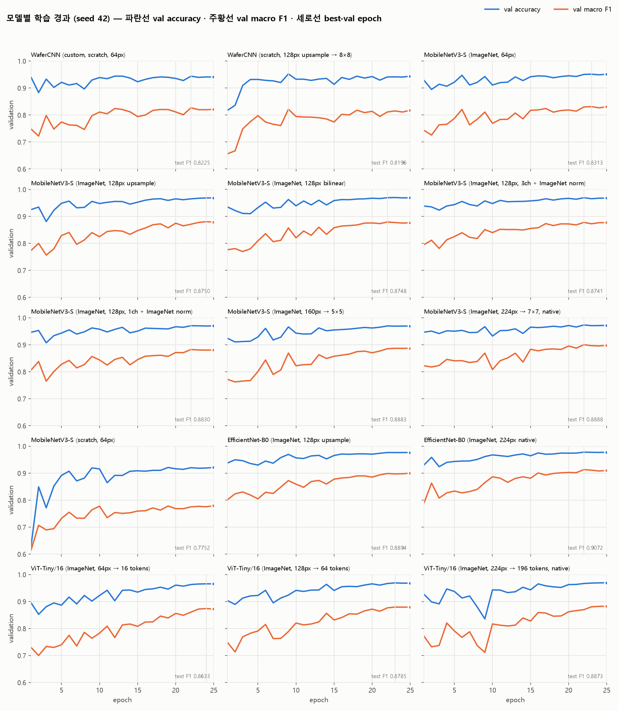
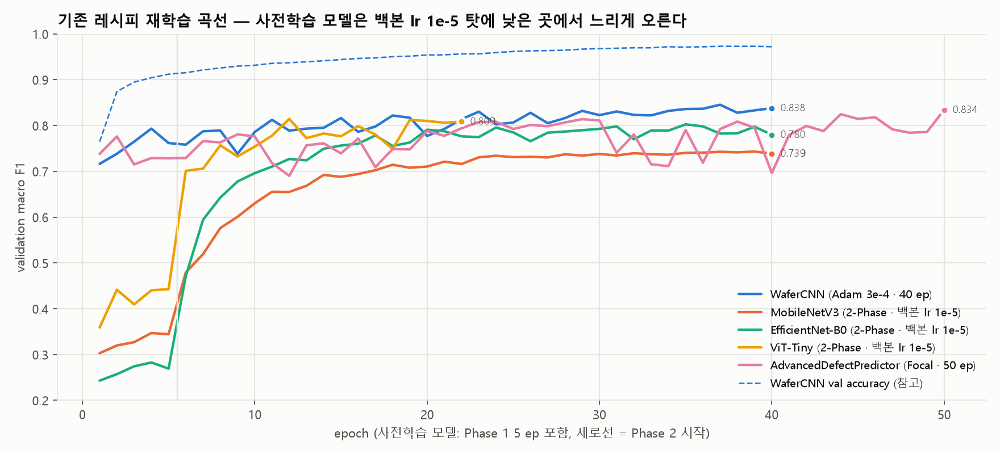

# 모델 성능 재측정 보고서 (2026-09-15)

모든 수치는 **Test 25,943개** (증강·샘플러 미적용, 원본 불균형 분포) 기준이며, 같은 체크포인트에서 Accuracy · macro F1 · weighted F1 · macro Precision/Recall 을 동시에 계산했다.
`macro F1 95% CI` 는 테스트셋 bootstrap 1,000회 재표집 구간이다. 두 모델의 구간이 크게 겹치면 그 차이는 테스트셋 표본 잡음 수준이다.

## 0. 핵심 결론

1. **기존 README 수치는 재현된다.** 기존 레시피로 다시 학습한 WaferCNN macro F1 0.8508, MobileNetV3-Small 0.7372 로 이전 기재값(0.8458 / 0.7369)과 ±0.025 안에서 일치한다.
2. **그러나 "커스텀 CNN > MobileNet" 은 레시피 차이였다.** 같은 레시피(AdamW 3e-4 · 25 ep · 조기종료 없음)에서 WaferCNN 0.8311 ± 0.0088 vs MobileNetV3-S 64px 0.8341 ± 0.0044 (3 seeds) — 기존 파인튜닝의 백본 학습률 1e-5 가 MobileNet 을 0.10 가까이 깎아 먹고 있었다.
3. **입력 해상도가 가장 큰 변인이다.** 64×64 를 128×128 로 nearest 업샘플만 해도 MobileNetV3-S 는 0.8756 ± 0.0026 (3 seeds), 40 epoch 에서는 0.8847 에 도달한다. stride-32 백본이 64px 에서 2×2 feature map 으로 붕괴하는 문제가 해소되기 때문이다. Scratch(선형 결함) precision 이 0.4~0.5 → 0.7~0.8 로 오르는 것이 대표적 효과다.
4. **ImageNet 전이는 도움이 된다.** 같은 조건에서 scratch 초기화 MobileNetV3-S 는 0.7752 로 ImageNet 초기화보다 낮다.
5. **최고 성능은 EfficientNet-B0 128px 0.8894** (Acc 97.54%), 그 다음이 MobileNetV3-S 128px 이다. 프로젝트 목표(macro F1 ≥ 0.88)는 이 두 구성에서 달성된다.
6. **val macro F1 은 epoch 간 ±0.03 요동**하므로(소수 클래스 22~83개) 조기종료·best-val 선택은 seed 운에 좌우된다. WaferCNN 은 best-val 체크포인트와 마지막 epoch 의 test F1 차이가 최대 0.017 인 반면, 사전학습 모델은 0.005 이내로 안정적이다.

## 1. 기존 학습 레시피 그대로 재학습한 결과 (`scripts/retrain_*.py` → `scripts/evaluate_all.py`)

환경: NVIDIA GeForce RTX 4070 Laptop GPU · seed 42 · 결과 파일 `analysis/final_evaluation.json`

| 모델 | 파라미터 | Accuracy | **macro F1** | 95% CI | weighted F1 | macro P | macro R | 체크포인트 |
|---|---:|---:|---:|:---:|---:|---:|---:|---|
| WaferCNN | 1.21M | 95.85% | **0.8508** | [0.8353, 0.8635] | 0.9616 | 0.7929 | 0.9343 | `checkpoints/WaferCNN_37_0.8453.pth` |
| AdvancedDefectPredictor | 1.13M | 95.12% | **0.8229** | [0.8049, 0.8372] | 0.9549 | 0.7778 | 0.8848 | `checkpoints/AdvancedDefectPredictor_best_0.8340.pth` |
| ViT-Tiny | 5.39M | 94.34% | **0.8106** | [0.7956, 0.8232] | 0.9495 | 0.7588 | 0.8963 | `checkpoints/ViT-Tiny_07_0.8144.pth` |
| EfficientNet-B0 | 4.02M | 94.16% | **0.8020** | [0.7836, 0.8165] | 0.9478 | 0.7313 | 0.9160 | `checkpoints/EfficientNet-B0_30_0.8025.pth` |
| MobileNetV3-Small | 1.53M | 90.41% | **0.7372** | [0.7204, 0.7507] | 0.9196 | 0.6606 | 0.8910 | `checkpoints/MobileNetV3_34_0.7431.pth` |

### 1.1 클래스별 F1

| 모델 | none | Center | Donut | Edge-Loc | Edge-Ring | Loc | Near-full | Random | Scratch |
|---|---:|---:|---:|---:|---:|---:|---:|---:|---:|
| WaferCNN | 0.979 | 0.868 | 0.907 | 0.784 | 0.970 | 0.749 | 0.936 | 0.818 | 0.645 |
| AdvancedDefectPredictor | 0.976 | 0.862 | 0.861 | 0.745 | 0.959 | 0.680 | 0.909 | 0.822 | 0.593 |
| ViT-Tiny | 0.971 | 0.850 | 0.861 | 0.728 | 0.970 | 0.642 | 0.957 | 0.841 | 0.477 |
| EfficientNet-B0 | 0.970 | 0.809 | 0.886 | 0.719 | 0.968 | 0.669 | 0.894 | 0.788 | 0.515 |
| MobileNetV3-Small | 0.948 | 0.773 | 0.802 | 0.625 | 0.933 | 0.603 | 0.917 | 0.752 | 0.282 |

### 1.2 클래스별 Precision / Recall (Scratch·Loc·Edge-Loc 병목 확인용)

| 모델 | 클래스 | support | precision | recall | f1 |
|---|---|---:|---:|---:|---:|
| WaferCNN | Edge-Loc | 779 | 0.6852 | 0.9166 | 0.7842 |
| WaferCNN | Loc | 539 | 0.6546 | 0.8757 | 0.7492 |
| WaferCNN | Scratch | 179 | 0.5000 | 0.9106 | 0.6455 |
| AdvancedDefectPredictor | Edge-Loc | 779 | 0.6312 | 0.9076 | 0.7446 |
| AdvancedDefectPredictor | Loc | 539 | 0.5858 | 0.8108 | 0.6802 |
| AdvancedDefectPredictor | Scratch | 179 | 0.4981 | 0.7318 | 0.5928 |
| ViT-Tiny | Edge-Loc | 779 | 0.6128 | 0.8960 | 0.7278 |
| ViT-Tiny | Loc | 539 | 0.5254 | 0.8256 | 0.6421 |
| ViT-Tiny | Scratch | 179 | 0.3450 | 0.7709 | 0.4767 |
| EfficientNet-B0 | Edge-Loc | 779 | 0.6014 | 0.8947 | 0.7193 |
| EfficientNet-B0 | Loc | 539 | 0.5726 | 0.8052 | 0.6692 |
| EfficientNet-B0 | Scratch | 179 | 0.3630 | 0.8883 | 0.5154 |
| MobileNetV3-Small | Edge-Loc | 779 | 0.4835 | 0.8845 | 0.6252 |
| MobileNetV3-Small | Loc | 539 | 0.5012 | 0.7551 | 0.6025 |
| MobileNetV3-Small | Scratch | 179 | 0.1712 | 0.8045 | 0.2824 |

## 2. 동일 프로토콜 공정 비교 (`scripts/fair_compare.py`)

기존 파이프라인은 WaferCNN(전체 파라미터 Adam 3e-4)과 사전학습 모델(2-Phase, 백본 lr 1e-5)의 레시피가 달라 아키텍처 효과를 분리할 수 없었다. 아래는 모든 모델을 같은 옵티마이저·LR·증강·샘플러·epoch 예산·선택 기준으로 학습하고 seed 를 반복한 결과다.

프로토콜: AdamW lr 0.0003 · wd 0.0001 · batch 64 · CosineAnnealingLR(eta_min=1e-6) · CrossEntropyLoss (weight 없음) · WeightedRandomSampler(balanced) · 선택 기준 val macro F1 (best) + last epoch 병기

| 모델 | 파라미터 | seeds | Accuracy | **macro F1 mean ± std** | min – max | weighted F1 | macro P | macro R | best epoch(평균) |
|---|---:|:-:|---:|---:|:---:|---:|---:|---:|---:|
| WaferCNN (custom, scratch, 64px) | 1.21M | 3 | 95.11% | **0.8311 ± 0.0088** | 0.8225 – 0.8401 | 0.9556 | 0.7668 | 0.9338 | 17.0 |
| WaferCNN (custom, scratch, 64px) [ep40] | 1.21M | 1 | 95.15% | **0.8367 ± 0.0000** | 0.8367 – 0.8367 | 0.9563 | 0.7734 | 0.9382 | 28.0 |
| MobileNetV3-S (ImageNet, 64px) | 1.53M | 3 | 95.52% | **0.8341 ± 0.0044** | 0.8313 – 0.8392 | 0.9584 | 0.7885 | 0.8961 | 21.3 |
| MobileNetV3-S (ImageNet, 128px upsample) | 1.53M | 3 | 96.91% | **0.8756 ± 0.0026** | 0.8733 – 0.8784 | 0.9702 | 0.8529 | 0.9030 | 23.0 |
| MobileNetV3-S (ImageNet, 128px upsample) [ep40] | 1.53M | 1 | 97.42% | **0.8847 ± 0.0000** | 0.8847 – 0.8847 | 0.9744 | 0.8875 | 0.8840 | 39.0 |
| MobileNetV3-S (scratch, 64px) | 1.53M | 1 | 92.37% | **0.7752 ± 0.0000** | 0.7752 – 0.7752 | 0.9337 | 0.7097 | 0.8960 | 25.0 |
| EfficientNet-B0 (ImageNet, 128px upsample) | 4.02M | 1 | 97.54% | **0.8894 ± 0.0000** | 0.8894 – 0.8894 | 0.9759 | 0.8755 | 0.9063 | 25.0 |
| ViT-Tiny/16 (ImageNet, 64px → 16 tokens) | 5.39M | 1 | 96.53% | **0.8633 ± 0.0000** | 0.8633 – 0.8633 | 0.9668 | 0.8410 | 0.8906 | 24.0 |
| WaferCNN (scratch, 128px upsample → 8×8) | 1.21M | 1 | 95.41% | **0.8196 ± 0.0000** | 0.8196 – 0.8196 | 0.9587 | 0.7550 | 0.9289 | 9.0 |
| MobileNetV3-S (ImageNet, 128px bilinear) | 1.53M | 1 | 97.04% | **0.8748 ± 0.0000** | 0.8748 – 0.8748 | 0.9712 | 0.8619 | 0.8915 | 22.0 |
| MobileNetV3-S (ImageNet, 128px, 3ch + ImageNet norm) | 1.53M | 1 | 96.99% | **0.8741 ± 0.0000** | 0.8741 – 0.8741 | 0.9708 | 0.8556 | 0.8972 | 22.0 |
| MobileNetV3-S (ImageNet, 128px, 1ch + ImageNet norm) | 1.53M | 1 | 97.04% | **0.8830 ± 0.0000** | 0.8830 – 0.8830 | 0.9713 | 0.8635 | 0.9066 | 22.0 |
| MobileNetV3-S (ImageNet, 160px → 5×5) | 1.53M | 1 | 97.05% | **0.8883 ± 0.0000** | 0.8883 – 0.8883 | 0.9714 | 0.8742 | 0.9061 | 25.0 |
| MobileNetV3-S (ImageNet, 224px → 7×7, native) | 1.53M | 1 | 97.27% | **0.8888 ± 0.0000** | 0.8888 – 0.8888 | 0.9735 | 0.8702 | 0.9109 | 22.0 |
| EfficientNet-B0 (ImageNet, 224px native) | 4.02M | 1 | 97.78% | **0.9072 ± 0.0000** | 0.9072 – 0.9072 | 0.9782 | 0.9032 | 0.9125 | 22.0 |
| ViT-Tiny/16 (ImageNet, 128px → 64 tokens) | 5.40M | 1 | 97.00% | **0.8785 ± 0.0000** | 0.8785 – 0.8785 | 0.9712 | 0.8551 | 0.9081 | 23.0 |
| ViT-Tiny/16 (ImageNet, 224px → 196 tokens, native) | 5.43M | 1 | 96.92% | **0.8873 ± 0.0000** | 0.8873 – 0.8873 | 0.9707 | 0.8604 | 0.9203 | 25.0 |

### 2.1 클래스별 F1 (seed 평균)

| 모델 | none | Center | Donut | Edge-Loc | Edge-Ring | Loc | Near-full | Random | Scratch |
|---|---:|---:|---:|---:|---:|---:|---:|---:|---:|
| WaferCNN (custom, scratch, 64px) | 0.975 | 0.849 | 0.920 | 0.767 | 0.967 | 0.719 | 0.931 | 0.785 | 0.569 |
| WaferCNN (custom, scratch, 64px) [ep40] | 0.975 | 0.864 | 0.917 | 0.785 | 0.968 | 0.689 | 0.978 | 0.796 | 0.559 |
| MobileNetV3-S (ImageNet, 64px) | 0.978 | 0.874 | 0.881 | 0.754 | 0.959 | 0.731 | 0.927 | 0.821 | 0.583 |
| MobileNetV3-S (ImageNet, 128px upsample) | 0.985 | 0.895 | 0.904 | 0.812 | 0.974 | 0.775 | 0.913 | 0.874 | 0.748 |
| MobileNetV3-S (ImageNet, 128px upsample) [ep40] | 0.988 | 0.918 | 0.870 | 0.835 | 0.972 | 0.791 | 0.933 | 0.868 | 0.787 |
| MobileNetV3-S (scratch, 64px) | 0.959 | 0.818 | 0.905 | 0.676 | 0.933 | 0.657 | 0.913 | 0.756 | 0.360 |
| EfficientNet-B0 (ImageNet, 128px upsample) | 0.989 | 0.921 | 0.911 | 0.840 | 0.976 | 0.811 | 0.894 | 0.883 | 0.781 |
| ViT-Tiny/16 (ImageNet, 64px → 16 tokens) | 0.984 | 0.914 | 0.914 | 0.780 | 0.968 | 0.741 | 0.955 | 0.833 | 0.683 |
| WaferCNN (scratch, 128px upsample → 8×8) | 0.977 | 0.879 | 0.889 | 0.783 | 0.977 | 0.711 | 0.863 | 0.795 | 0.503 |
| MobileNetV3-S (ImageNet, 128px bilinear) | 0.986 | 0.885 | 0.873 | 0.820 | 0.975 | 0.789 | 0.909 | 0.892 | 0.743 |
| MobileNetV3-S (ImageNet, 128px, 3ch + ImageNet norm) | 0.986 | 0.894 | 0.886 | 0.821 | 0.972 | 0.789 | 0.933 | 0.864 | 0.723 |
| MobileNetV3-S (ImageNet, 128px, 1ch + ImageNet norm) | 0.986 | 0.899 | 0.932 | 0.817 | 0.974 | 0.786 | 0.933 | 0.876 | 0.744 |
| MobileNetV3-S (ImageNet, 160px → 5×5) | 0.986 | 0.906 | 0.946 | 0.816 | 0.970 | 0.782 | 0.952 | 0.891 | 0.747 |
| MobileNetV3-S (ImageNet, 224px → 7×7, native) | 0.987 | 0.901 | 0.918 | 0.837 | 0.980 | 0.788 | 0.957 | 0.883 | 0.750 |
| EfficientNet-B0 (ImageNet, 224px native) | 0.990 | 0.923 | 0.909 | 0.863 | 0.985 | 0.810 | 0.977 | 0.893 | 0.816 |
| ViT-Tiny/16 (ImageNet, 128px → 64 tokens) | 0.986 | 0.907 | 0.887 | 0.820 | 0.972 | 0.781 | 0.957 | 0.884 | 0.713 |
| ViT-Tiny/16 (ImageNet, 224px → 196 tokens, native) | 0.985 | 0.920 | 0.927 | 0.803 | 0.975 | 0.761 | 0.978 | 0.863 | 0.774 |

### 2.2 run 별 원자료

| model | seed | best ep | val F1 | test Acc | test macro F1 | 95% CI | 학습(min) |
|---|:-:|:-:|---:|---:|---:|:---:|---:|
| effb0_pre128 | 42 | 25 | 0.8997 | 0.9754 | 0.8894 | [0.8710, 0.9034] | 85.9 |
| effb0_pre224 | 42 | 22 | 0.9130 | 0.9778 | 0.9072 | [0.8945, 0.9178] | 456.3 |
| mv3_pre128 | 42 | 24 | 0.8801 | 0.9694 | 0.8750 | [0.8576, 0.8884] | 44.4 |
| mv3_pre128 | 43 | 25 | 0.8724 | 0.9679 | 0.8733 | [0.8560, 0.8878] | 27.9 |
| mv3_pre128 | 44 | 20 | 0.8824 | 0.9700 | 0.8784 | [0.8612, 0.8917] | 38.6 |
| mv3_pre128@ep40 | 42 | 39 | 0.8903 | 0.9742 | 0.8847 | [0.8667, 0.8977] | 55.8 |
| mv3_pre128_3ch | 42 | 22 | 0.8777 | 0.9699 | 0.8741 | [0.8573, 0.8873] | 42.1 |
| mv3_pre128_bil | 42 | 22 | 0.8790 | 0.9704 | 0.8748 | [0.8567, 0.8888] | 43.0 |
| mv3_pre128_norm | 42 | 22 | 0.8822 | 0.9704 | 0.8830 | [0.8664, 0.8950] | 43.0 |
| mv3_pre160 | 42 | 25 | 0.8867 | 0.9705 | 0.8883 | [0.8729, 0.8997] | 42.8 |
| mv3_pre224 | 42 | 22 | 0.8999 | 0.9727 | 0.8888 | [0.8740, 0.9004] | 62.3 |
| mv3_pre64 | 42 | 23 | 0.8309 | 0.9546 | 0.8313 | [0.8138, 0.8450] | 37.9 |
| mv3_pre64 | 43 | 19 | 0.8259 | 0.9532 | 0.8318 | [0.8142, 0.8458] | 30.9 |
| mv3_pre64 | 44 | 22 | 0.8332 | 0.9579 | 0.8392 | [0.8216, 0.8532] | 28.9 |
| mv3_scratch64 | 42 | 25 | 0.7787 | 0.9237 | 0.7752 | [0.7572, 0.7891] | 44.9 |
| vit_pre128 | 42 | 23 | 0.8792 | 0.9700 | 0.8785 | [0.8634, 0.8902] | 36.1 |
| vit_pre224 | 42 | 25 | 0.8825 | 0.9692 | 0.8873 | [0.8745, 0.8975] | 83.0 |
| vit_pre64 | 42 | 24 | 0.8737 | 0.9653 | 0.8633 | [0.8490, 0.8757] | 42.9 |
| wafercnn | 42 | 22 | 0.8265 | 0.9445 | 0.8225 | [0.8089, 0.8346] | 77.8 |
| wafercnn | 43 | 22 | 0.8261 | 0.9465 | 0.8307 | [0.8180, 0.8433] | 23.1 |
| wafercnn | 44 | 7 | 0.8478 | 0.9623 | 0.8401 | [0.8221, 0.8544] | 14.5 |
| wafercnn@ep40 | 42 | 28 | 0.8366 | 0.9515 | 0.8367 | [0.8238, 0.8482] | 32.9 |
| wafercnn_128 | 42 | 9 | 0.8210 | 0.9541 | 0.8196 | [0.7997, 0.8347] | 51.7 |

## 3. 모델별 특화 입력 전처리 실험 (2차 · `Preprocess` 모듈 · seed 42)

DataLoader 는 64px 증강 파이프라인을 그대로 쓰고, 모델 직전 GPU 위에서 해상도·보간·채널·정규화만 바꿨다. 학습 레시피는 1차와 동일.

| 변인 | 비교 | 결과 | 판정 |
|---|---|---|---|
| 해상도 (MobileNetV3-S) | 64 → 128 → 160 → 224px | 0.8341 → 0.8756 → 0.8883 → 0.8888 | **가장 큰 변인.** 160px 에서 포화 (224px 는 연산 2배에 이득 없음) |
| 해상도 (EfficientNet-B0) | 128 → 224px (원본) | 0.8894 → 0.9072 | **전체 최고.** 마지막 epoch 모델은 0.9122 |
| 토큰 수 (ViT-Tiny/16) | 16 → 64 → 196 tokens | 0.8633 → 0.8785 → 0.8873 | 단조 증가. 단 5.4M 파라미터로 MobileNetV3-S 160px(1.53M) 와 동급 |
| 해상도 (WaferCNN 대조군) | 64 → 128px | 0.8311 → 0.8196 | **개선 없음.** 해상도 효과는 stride-32 사전학습 백본에 특유한 구조적 현상 |
| 보간 | nearest vs bilinear (128px) | 0.8756 vs 0.8748 | 차이 없음 (3값 픽셀 유지 여부 무관) |
| 채널·정규화 | 1ch 평균 conv vs 3ch 복제 + ImageNet norm | 0.8756 vs 0.8741 | 차이 없음 (사전학습 conv1 원형 유지 이점 없음) |
| 정규화 단독 | 1ch vs 1ch + ImageNet norm | 0.8756 vs 0.8830 | +0.007, 3-seed std 의 약 3배지만 CI 겹침 → seed 반복 필요 |

**해석.** 64×64 입력에서 stride-32 백본(MobileNetV3·EfficientNet)의 마지막 feature map 은 2×2 로 붕괴하고, 이때 위치·형태 정보(Center/Loc/Edge-Loc 구분, Scratch 의 선형성)가 사라진다. 업샘플은 정보를 추가하지 않지만 백본이 공간 구조를 유지하며 처리할 수 있게 해 준다. WaferCNN 은 64px 에서 이미 4×4 를 확보하므로 같은 처치에 반응하지 않는다. 클래스별로는 Scratch F1 이 0.57 → 0.75~0.81, Loc 0.72 → 0.78~0.81, Edge-Loc 0.77 → 0.81~0.86 으로 오르고, none·Edge-Ring 은 모든 모델이 0.96 이상이라 변화가 없다.

**배포 관점 권장 구성.** MobileNetV3-S 160px (1.53M · macro F1 0.888) — EfficientNet-B0 224px(4.02M · 0.907) 대비 0.02 낮지만 연산량은 약 1/8. 정확도 최우선이면 EfficientNet-B0 224px.

## 4. 시각화 (`scripts/plot_results.py` → `analysis/figures/`)

| 그림 | 내용 |
|---|---|
|  | **fig1** 모델별 macro F1 — 기존 레시피(주황) vs 동일 레시피(파랑). 오차막대 = 95% CI 또는 3 seeds ± std |
|  | **fig2** 모델별 입력 전처리 변인 — 해상도만 막대 길이를 바꾼다 |
|  | **fig3** 클래스별 F1 — 해상도 이득은 Scratch·Loc·Edge-Loc 에 집중 |
|  | **fig4** 모델별 학습 경과 (epoch 별 val accuracy·val macro F1) |
|  | **fig5** 핵심 모델 학습 곡선 overlay — 해상도가 높을수록 첫 epoch 부터 위에서 시작해 순서가 바뀌지 않는다 |
|  | **fig6** 기존 레시피 재학습 곡선 — 2-Phase 사전학습 모델은 Phase 2 에서도 백본 lr 1e-5 탓에 느리게 오른다 |

